# SC8815 High Efficiency, Synchronous, Bi-Directional Buck-Boost Charger Controller with I2C Interface

# 1 Description

SC8815 is a synchronous buck-boost charger controller which can support reverse discharging operation. It can support up to 36V battery voltage, so can be used to effectively manage the charging for 1\~6 cell Li-ion batteries no matter adapter voltage is higher, lower or equal to battery voltage. When a system needs to generate an output from the battery, SC8815 can also discharge the cells and delivers desired output up to 36V.

Through its I2C interface, user can set the charging / discharging mode easily, and program the charging current, charging voltage, reserve output voltage, current limits, switching frequency and other parameters flexibly. Besides that, SC8815 integrates 10-bit ADC, so user can read the VBUS / VBAT voltage and current in real time, simplifying the system design.

SC8815 supports internal current limit, over voltage protection, output short protection and over temperature protections to ensure safety under different abnormal conditions.

The SC8815 is in a 32 pin 4x4 QFN package.

# 2 Features

Buck-Boost Battery Charger for 1 to 6 Cell Batteries   
Charging Management including Trickle Charge,   
CC Charge, CV Charge and Charge Termination   
Buck-Boost Reverse Discharging Mode   
Wide VBAT Range: 2.7 V to 36 V, 40V sustainable   
Wide VBUS Range: 2.7 V to 36 V, 40V sustainable   
I2C Programmable Charging Current and Voltage   
I2C Programmable Discharging Output Voltage   
I2C Programmable Input / Output Current Limit   
I2C Programmable Switching Frequency   
High Efficiency Buck-Boost Conversion   
10-bit ADC resources   
Charging Status Indication   
Event Detections, including Automatic Adapter   
Insert and Automatic Load Insert Detection   
Power Path Control   
Under Voltage Protection, Over Voltage Protection,   
Over Current Protection, Short Circuit Protection   
and Thermal Shutdown Protection   
QFN-32 Package

# 3 Applications

Power Bank with Fast Charge Function   
USB Power Delivery   
Type C Hub   
Industrial Power Supplies

# 4 Device Information

<html><body><table><tr><td>Part Number</td><td> Packagee</td><td>Dimension</td></tr><tr><td>SC8815QDER</td><td>32 pin QFN</td><td>4.0mm x 4.0mm x 0.75mm</td></tr></table></body></html>

# 5 Typical Application Circuit

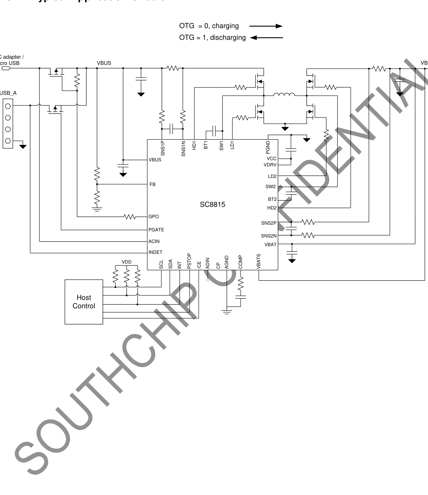

# 6 Terminal Configuration and Functions

<html><body><table><tr><td colspan="5">Top View NISNS YBUS BTT lMS PNNd 32 |31] |30| |29 |28 |27! |26 |25 SNS1P VCC GPO LD2 CP [2 SW2 PGATE/DITHER 33 ID2 INDET 57 PGND 20 BT ACIN VBAT /CE SNS2P PSTOP SNS2N 197 10 [11 12 13 141516) SCL SAA INI AGCT AADN COMP CBATS TERMINAL DESCRIPTION 1 ENTIAL</td></tr><tr><td></td><td colspan="2"></td><td colspan="2"></td></tr><tr><td>NUMBER</td><td> NAME</td><td rowspan="3">I/O</td><td colspan="2"></td></tr><tr><td></td><td>SNS1P</td><td colspan="2">Positive input of a current sense amplifier. Connect to one pad of the current sense resistor (typical 10 mQ) on the power path to sense the current into or out from VBUS.</td></tr><tr><td></td><td>GPO</td><td colspan="2">Open dreinautputfs ienerau urpose stir contolled by GPo_ctRL bit user can use this pin toe</td></tr><tr><td>2</td><td></td><td></td><td colspan="2">Driver for external charge pump circuit. (CHARGE PUMP NOT RECOMMENDED. !t is suggested to leave this pin floating, and connect VDRV with VCC. Consult local FAE if</td></tr><tr><td>3 4</td><td>CP PGATE/DITHER</td><td>10</td><td colspan="2">charge pump is needed) PMOS gate driver controlled by PGATE bit, used to control the external PMOS on the power path. This pin can be configured through I2C for switching frequency dithering function. Connect</td></tr><tr><td></td><td>INDET</td><td></td><td colspan="2">a ceramic capacitor (typical 100nF) from this pin to ground when for frequency dither function. Connect this pin to a USB-A port to detect the load insertion event. When an insertion event is detected, the IC sets INDET bit and outputs an INT interrupt pulse to inform MCU.</td></tr><tr><td></td><td>ACIN</td><td></td><td colspan="2">Connect this pin to AC adapter input node or micro-USB port to detect an AC adapter insertion event. When an insertion event is detected, the IC sets AC_OK bit and outputs an INT interrupt pulse to inform MCU.</td></tr><tr><td>7</td><td>/CE</td><td></td><td colspan="2">Chip enable control. Pull this pin to logic low to enable the IC; pull this pin to logic high to disable the IC. This pin is internally pulled low..</td></tr></table></body></html>

<html><body><table><tr><td>8</td><td>PSTOP</td><td></td><td>Power stop control. Pull this pin to logic low to enable the power blocks; pull this pin to logic high to disabled the power blocks, and the IC enters into Standby mode. In Standby mode, only the AC adapter and load insert detection functions and the I2C circuits keep working. This pin is internally pulled low..</td></tr><tr><td>9</td><td>SCL</td><td></td><td>I2C interface clock. Connect SCL to the logic rail through a pull up resistor (typical 10 kQ). The IC works as a slave, and the I2C address is 0x74H.</td></tr><tr><td>10</td><td>SDA</td><td>1/O</td><td>I2C interface data. Connect SDA to the logic rail through a pull up resistor (typical 10 k)</td></tr><tr><td>11</td><td>INT</td><td>0</td><td>An open drain output for interrupt signal. The IC sends a logic low pulse at INT pin to inform the host if an interrupt event happens..</td></tr><tr><td>12</td><td>AGND</td><td>1/0</td><td>Analog ground. Connect PGND and AGND together at the thermal pad under IC.</td></tr><tr><td>13</td><td>ADIN</td><td></td><td>ADC input pin. Apply an analog signal ( 2.048v) to this pin, the internal 10-bit ADC can convert this analog signal to digital signals, and store the digital values in a register.</td></tr><tr><td>14</td><td>FB</td><td></td><td>Feedback node for VBUS voltage. Connect a resistor divider from VBUS to FB to set the VBUS discharging output voltage in external way. The FB reference can also be programmed through</td></tr><tr><td>15</td><td>COMP</td><td></td><td>I2C. Connect resistor and capacitor at this pin to compensate the control loop.</td></tr><tr><td>16</td><td>VBATS</td><td></td><td>Sense node for VBAT voltage. Connect to VBAT rail if internal way is selected for VBAT charging termination voltage setting; connect a resistor divider at VBATS external way is selected.</td></tr><tr><td>17</td><td>SNS2N</td><td></td><td></td></tr><tr><td>18</td><td>SNS2P</td><td></td><td></td></tr><tr><td>19</td><td>VBAT</td><td></td><td></td></tr><tr><td>20</td><td>BT2</td><td></td><td>onneF capacir between BT2 pin and w2 pn to ootra a biasvotage fr igh</td></tr><tr><td>21</td><td>HD2</td><td></td><td>Gate driver output to control the external high side power MOSFET.</td></tr><tr><td>22</td><td>SW2</td><td>C</td><td>Switching node. Connect to the inductor.</td></tr><tr><td>23</td><td>LD2</td><td>0</td><td>Gate driver output to control the external low side power MOSFET.</td></tr><tr><td>24</td><td>vcC</td><td>0</td><td>Output of an internal 5V linear regulator. Connect a 1 F capacitor from VCC pin to PGND as close to the IC as possible..</td></tr><tr><td></td><td>VDRV</td><td></td><td>Power supply input for internal driver circuits. One way of getting the power supply is to connect VCC to this pin directly. Another way is to use the CP driver to implement a charge pump between VCC and VDRV pin. (CHARGE PUMP WAY IS NOT RECOMMENDED. CONSULT</td></tr><tr><td>26</td><td>PGND</td><td>1/O</td><td>LOCAL FAE IF CHARGE PUMP IS USED) Power ground. Connect PGND and AGND together at the PGND thermal pad under IC.</td></tr><tr><td>27</td><td>LD1</td><td>0</td><td>Gate driver output to the external low side MOSFET.</td></tr><tr><td>28</td><td>SW1</td><td>I/O</td><td>Switching Node. Connect to the inductor.</td></tr><tr><td>29</td><td>HD1</td><td>0</td><td>Gate driver output to the external high side MOSFET.</td></tr></table></body></html>

<html><body><table><tr><td>30</td><td>BT1</td><td></td><td>Connect a 100nF capacitor between BT1 pin and SW1 pins to bootstrap a bias voltage for high side MOSFET driver.</td></tr><tr><td>31</td><td>VBUS</td><td></td><td>Power supply to the IC. Connect to the VBUS rail. Place a 1 F capacitor from this pin to PGND as close to the IC as possible.</td></tr><tr><td> 32</td><td>SNS1N</td><td></td><td>Nepiatiye inut o h eurentr sense ampisier Conect to or ad of e curent sense resistor</td></tr><tr><td>33</td><td>Thermal Pad</td><td></td><td>PGND thermal pad. Connect PGND and AGND together at the thermal pad under IC.</td></tr></table></body></html>

# 7 Specifications

# 7.1 Absolute Maximum Ratings

over operating free-air temperature range (unless otherwise noted) (1)

<html><body><table><tr><td colspan="2"></td><td>MIn</td><td>MAX</td><td>Unit</td></tr><tr><td rowspan="10">Voltage range at. terminals(2)</td><td colspan="2">CP, LD2, VCC, VDRV, LD1 HD1 to SW1, BT1 to SW1, BT2 to SW2, HD2 to SW2</td><td>-0.3 6.5</td><td></td></tr><tr><td colspan="2">PSTOP</td><td>6</td><td>V</td></tr><tr><td>SCL, SDA, INT, ADIN, COMP</td><td>-0.3 -0.3</td><td>5</td><td>v</td></tr><tr><td>FB</td><td>-0.3</td><td>30</td><td>v</td></tr><tr><td>VBUS, SNS1N, SNS1P, GPO, PGATE, INDET, ACIN, VBATS, SNS2N,</td><td>-0.3</td><td>40</td><td>v</td></tr><tr><td>SNS2P, VBAT, SW2, SW1, /CE VBUS to SNS1P, SNS1N</td><td>-0.3</td><td>11</td><td>V</td></tr><tr><td>VBAT to SNS2P, SNS2N</td><td>-0.3</td><td>11</td><td>v</td></tr><tr><td>SNS1P to SNS1N</td><td>-10</td><td>10</td><td>v</td></tr><tr><td>SNS2P to SNS2N</td><td>-10</td><td>10</td><td></td></tr><tr><td>BT1, HD1, BT2, HD2</td><td>-0.3</td><td>45</td><td>V</td></tr><tr><td>BT1 to HD1, BT2 to HD2</td><td>-0.3</td><td>6.5</td><td>v</td></tr><tr><td>Operating junction temperature range</td><td></td><td>-40</td><td>150</td><td>V oC</td></tr><tr><td>Tj Tstg</td><td>Storage temperature range</td><td>-65</td><td>150</td><td>oC</td></tr></table></body></html>

(1) Stresses beyond those listed under absolute maximum ratings may cause permanent damage to the device. These are stress ratings only, and functional operation of the device at these or any other conditions beyond those indicated under recommended operating conditions is not implied. Exposure to absolute-maximum-rated conditions for extended periods may affect device reliability. (2) All voltage values are with respect to network ground terminal

# 7.2 Thermal Information

<html><body><table><tr><td colspan="2">THERMAL RESISTANCE(1)</td><td>QFN-32 (4mmX4mm)</td><td>UnIT</td></tr><tr><td>OJA</td><td> Junction to ambient thermal resistance</td><td>35</td><td>C/W</td></tr><tr><td>0Jc</td><td> Junction to case resistance.</td><td>7</td><td>C/W</td></tr></table></body></html>

(1) Measured on JESD51-7, 4-layer PCB.

# 7.3 Handling Ratings

<html><body><table><tr><td>PARAMETER</td><td>DEFINITION</td><td> MIN</td><td>MAX</td><td>UnIT</td></tr><tr><td>ESD(1)</td><td>Human body model (HBM) ESD stress voltage(2)</td><td>-2</td><td>2</td><td>kV</td></tr><tr><td></td><td>Charged device model (CDM) ESD stress voltage(3)</td><td>-750</td><td>750</td><td></td></tr></table></body></html>

(1) Electrostatic discharge (ESD) to measure device sensitivity and immunity to damage caused by assembly line electrostatic discharges into the device.   
(2) Level listed above is the passing level per ANSI, ESDA, and JEDEC JS-001. JEDEC document JEP155 states that 500-V HBM allows safe manufacturing with a standard ESD control process.   
(3) Level listed above is the passing level per EIA-JEDEC JESD22-C101. JEDEC document JEP157 states that 250-V CDM allows safe manufacturing with a standard ESD control process.

# 7.4 Recommended Operating Conditions

<html><body><table><tr><td></td><td></td><td>MIN</td><td>MAX</td><td>UNIT</td></tr><tr><td>VBUS</td><td>VBUS voltage range</td><td>2.7</td><td>36</td><td>v</td></tr></table></body></html>

<html><body><table><tr><td>VBAT</td><td>VBAT voltage range</td><td>2.7</td><td>36</td><td>v</td></tr><tr><td>CBus, CBAT</td><td>VBUS Capacitance, VBAT capacitance</td><td>30</td><td></td><td> F</td></tr><tr><td>L</td><td>Inductance</td><td>2.2</td><td>10</td><td>uH</td></tr><tr><td>RsNS1/2</td><td>Current Sensing Resistor</td><td>5</td><td>10</td><td> mQ</td></tr><tr><td>TA</td><td>Operating ambient temperature</td><td>-40</td><td>85</td><td>oC</td></tr><tr><td>TJ</td><td>Operating junction temperature</td><td>-40</td><td>125</td><td>C</td></tr></table></body></html>

# 7.5 Electrical Characteristics

$T _ { \mathsf { J } } = 2 5 ^ { \circ } \mathsf { C }$ and VBUS $= 5 \mathsf { V }$ , $\mathsf { V } _ { \mathsf { B A T } } = 1 0 . 8 \mathsf { V }$ unless otherwise noted.

<html><body><table><tr><td colspan="7">TYP MAX UNIT</td></tr><tr><td colspan="7">PARAMETER TEST CONDITIONS</td></tr><tr><td colspan="7">SUPPLY VOLTAGE</td></tr><tr><td rowspan="2">VUvLo_vBUS</td><td rowspan="2">YUS under volage lockout</td><td>Rising edge</td><td></td><td></td><td></td><td></td></tr><tr><td></td><td></td><td></td><td>7</td><td></td></tr><tr><td rowspan="2">VUVLO_VBAT</td><td rowspan="2">YBAT under-volage lokout</td><td></td><td></td><td></td><td>2.6</td><td></td></tr><tr><td>Ring edge</td><td></td><td></td><td></td><td>></td></tr><tr><td rowspan="4">Iq_VBAT</td><td rowspan="4">Quiescent current into VBAT</td><td>VBUS = 5V</td><td></td><td></td><td></td><td></td></tr><tr><td> PSTOP = L, non-switching</td><td>2.4</td><td></td><td>4</td><td>mA</td></tr><tr><td>VBUS = 5V PSTOP = L, after charging termination</td><td></td><td>2.4</td><td>4</td><td>mA</td></tr><tr><td> PSTOP = L, non-switching</td><td></td><td>25</td><td>40</td><td>A</td></tr><tr><td>IQ_vBUS ISB_VBAT</td><td>Quiescent current into VBUS Standby current into VBAT</td><td>VBUS open PSTOP = H, AD_START = 0</td><td>17</td><td></td><td>40</td><td>A</td></tr><tr><td></td><td></td><td>VBUS open PSTOP = H, AD_START =</td><td>0.65</td><td></td><td>1.2</td><td>mA</td></tr><tr><td>ISB_VBUS</td><td>Standby current into VBUS</td><td>PSTOP = H, AD_START = 0</td><td></td><td>12</td><td>50</td><td>A</td></tr><tr><td>ISD_VBAT</td><td>Shutdown current into VBAT</td><td>/CE = H, VBUS = open</td><td></td><td>10</td><td>20</td><td> A</td></tr><tr><td colspan="7"></td></tr><tr><td rowspan="2">VCC, DIRVER AND POWER SWITCH Vcc</td><td rowspan="2">VCC regulation voltage</td><td></td><td></td><td></td><td></td><td></td></tr><tr><td>PSTOP = L, VBUS = 9V PSTOP=L, VBUS = 5V</td><td>4.96</td><td>5.0</td><td>5.3</td><td>v</td></tr><tr><td rowspan="2"></td><td rowspan="2"></td><td> PSTOP = H,VBAT=3.6V</td><td></td><td></td><td>5</td><td>v v</td></tr><tr><td>PSTOP = L VBUS = 5V, VCC = 4.5V</td><td>25 17</td><td></td><td>3 30</td><td>mA</td></tr><tr><td rowspan="4">Ivcc_LIM</td><td rowspan="2">VCC current limit CH</td><td>PSTOP = L</td><td>160</td><td></td><td></td><td></td></tr><tr><td>VBUS = 9V, VCC = 4.5V PSTOP = H</td><td></td><td></td><td></td><td>mA</td></tr><tr><td rowspan="2">VDRV regulation voltage</td><td>change pump connected</td><td>5.8</td><td>6.2</td><td>1</td><td>mA v</td></tr><tr><td>VBUS = 5V, IDRV = 0mA change pump connected</td><td>5.7 6.1</td><td></td><td>6.5</td><td></td></tr><tr><td>RHs/Ls_pu</td><td>High/low side MOS driver pull up resistor</td><td>VBUS = 9V, IDRV = 30mA</td><td>4</td><td></td><td>6.4</td><td>v Q</td></tr><tr><td>Rhs/Ls_PD</td><td>dighow side MOS driver pul</td><td></td><td></td><td>1</td><td></td><td>Q</td></tr><tr><td colspan="7">REFERENCE VOLTAGE IN CHARGING MODE</td></tr><tr><td>VBATS_exI</td><td>VBATS reference voltage for</td><td>VBAT_SEL =1</td><td>1.197</td><td>1.203</td><td>1.209</td><td>v</td></tr><tr><td>VBATS_int</td><td>external setting VBATS accuracy for internal setting, over VBATS target</td><td>VBAT_SEL = 0, CSEL = 00 VCELL_SET=000~111</td><td>-0.5</td><td></td><td>0.5</td><td>%</td></tr><tr><td>VTRICKLE_int</td><td rowspan="2">Trickle charge threshold voltage</td><td>VBAT_SEL = 0, Cell number = N VCELL_SET = 000~1111,</td><td>2.73*N 2.94*N</td><td></td><td>3.15*N</td><td>v</td></tr><tr><td>for internal setting</td><td>TRICKLE_SET = 0 VBAT_SEL = 0, Cell number = N</td><td>2.31*N 2.52*N</td><td></td><td>2.73*N</td><td></td></tr></table></body></html>

<html><body><table><tr><td></td><td colspan="2"></td><td colspan="4"></td></tr><tr><td rowspan="3">VTRICKLE_ext</td><td rowspan="3">Trickle charge threshold for</td><td>VCELL_SET = 000~1111, TRICKLE_SET = 1</td><td>65</td><td colspan="2"></td></tr><tr><td>VBAT_SEL = 1, TRICKLE_SET = 0</td><td>70</td><td>75</td><td>%</td></tr><tr><td>external setting, over VBAT target VBAT_SEL =1, TRICKLE_SET = 1</td><td>55 60</td><td>65</td><td>%</td></tr><tr><td>VEOC</td><td>EOC voltage threshold, over VBAT target</td><td>VBAT_SEL = 0/1</td><td>97% 98%</td><td>99%</td><td></td></tr><tr><td>VRECH</td><td>Recharge threshold voltage, over VBAT target</td><td>VBAT_SEL = 0/1</td><td>94.8% 95.8%</td><td>96.8%</td><td></td></tr><tr><td rowspan="6">VINREG</td><td rowspan="4">VINREG reference voltage</td><td>4.5V target VINREG_SET = 0x2C, VINREG_RATIO = 0</td><td>4.3 4.5</td><td>4.</td><td>v</td></tr><tr><td>15V target VINREG_SET = 0x95, VINREG_RATIO = 0</td><td>14.7 15</td><td>15.3</td><td>v</td></tr><tr><td>4.48V target VINREG_SET = 0x6F, VINREG_RATIO = 1</td><td>4.4 4.5</td><td>4.6</td><td>v</td></tr><tr><td>10V target VINREG_SET = 0xF9, VINREG_RATIO = 1</td><td>9.8 10</td><td>10.2</td><td>v</td></tr><tr><td>VBAT OVP threshold, over VBAT VBAT_SEL = 0/1</td><td>103% 105.5%</td><td>108%</td><td></td></tr><tr><td>VCLAMP</td><td>target</td><td></td><td>125</td><td></td><td>mV</td></tr><tr><td colspan="2">REFERENCE VOLTAGE IN DISCHARGING MODE</td><td colspan="4"></td></tr><tr><td colspan="2">VFB e reference olage foretena</td><td></td><td></td><td></td><td></td></tr><tr><td rowspan="3">VBus</td><td rowspan="2">VBUS reference voltage accuracy for internal setting</td><td>FB_SEL=0</td><td>-2%</td><td>2%</td><td></td></tr><tr><td>VBUS_RATIO = 1 (5x) VBUS = 3.6 ~10.24V FB_SEL =0</td><td>-2%</td><td>2%</td><td></td></tr><tr><td></td><td>VBUS_RATIO = 0 (12.5x) VBUS = 9 ~ 24V VBUSREF_I_SET = 1V</td><td>-2%</td><td>2%</td><td></td></tr><tr><td rowspan="2">VBus_OvP CURRENT LIMIT</td><td>VBUS OVP threshold, rising edge Hysteresis</td><td>VBUSREF_E_SET = 1V VBUSREF_I_SET = 1V</td><td>107.3% 110%</td><td>113%</td><td></td></tr><tr><td></td><td>VBUSREF_E_SET = 1V</td><td>3%</td><td></td><td></td></tr><tr><td></td><td rowspan="4"></td><td>Charging mode, 6A target</td><td></td><td></td><td></td></tr><tr><td></td><td>IBUS_RATIO = 01 (6x) IBUS_LIM = 0x7F Charging mode, 3A target</td><td>-10%</td><td>10%</td><td></td></tr><tr><td>IBUS current limit accuracy</td><td>IBUS_RATIO = 10 (3x) IBUS_LIM = 0x7F Discharging mode, 6A target IBUS_RATIO = 01 (6x)</td><td>-10%</td><td>10%</td><td></td></tr><tr><td>IBUS_LIM = 0x7F IBUS_RATIO = 10 (3x)</td><td>Discharging mode, 3A target</td><td>-10% -10%</td><td>10% 10%</td><td></td></tr></table></body></html>

<html><body><table><tr><td colspan="6"></td></tr><tr><td rowspan="7">IBAT_LIM</td><td rowspan="4">IBAT current limit accuracy</td><td>Charging mode, 6A target IBAT_RATIO = 0 (6x) IBAT_LIM =0xFF</td><td>-10%</td><td>10%</td><td></td></tr><tr><td>Charging mode, 12A target IBAT_RATIO = 1 (12x) IBAT_LIM = 0xFF</td><td>-10%</td><td>10%</td><td></td></tr><tr><td>Discharging mode, 6A target IBAT_RATIO = 0 (6x) IBAT_LIM =0xFF</td><td>-15%</td><td colspan="2">15%</td><td></td></tr><tr><td>Discharging mode, 12A target IBAT_RATIO = 1 (12x) IBAT_LIM =0xFF</td><td>-15%</td><td></td><td>5%</td><td></td></tr><tr><td rowspan="2">ITRICKLE Thoke cha'ge curent oove</td><td></td><td></td><td>10%</td><td></td><td></td></tr><tr><td></td><td></td><td>22%</td><td></td><td></td></tr><tr><td rowspan="2">leoc</td><td rowspan="2"></td><td>EOC SET- </td><td rowspan="2"></td><td rowspan="2">1%</td><td rowspan="2"></td></tr><tr><td></td></tr><tr><td colspan="7"> ERROR AMPLIFIER</td></tr><tr><td></td><td></td><td></td><td>0.12</td><td>0.15</td><td></td><td></td></tr><tr><td colspan="7">Error amplifier gm</td></tr><tr><td>GmEA Rout</td><td>Error amplifier output resistance(1)</td><td></td><td></td><td>20</td><td>0.18</td><td>mS MQ</td></tr><tr><td>ISINK_COMP</td><td>COMP sink current</td><td>LOOP_SET = 0/1</td><td></td><td>25</td><td></td><td> A</td></tr><tr><td>ISRC_COMP</td><td>COMP source current</td><td>LOOP_SET = 0</td><td></td><td>18</td><td></td><td>A</td></tr><tr><td>IBIAS_FB</td><td>FB pin input bias current</td><td>LOOP_SET =1 FB_SEL=1 FB in regulation</td><td></td><td>32</td><td>50</td><td>A nA</td></tr><tr><td colspan="7">SWITCHING</td></tr><tr><td></td><td></td><td>FREQ_SET = 00 (150kHz)</td><td>140</td><td>155</td><td>170</td><td>kHz</td></tr><tr><td>fsw</td><td>Switching frequency</td><td>FREQ_SET = 01 (300kHz) FREQ_SET = 11 (450kHz)</td><td>270 400</td><td>305 450</td><td>330 500</td><td>kHz kHz</td></tr><tr><td colspan="7">POWER PATH MANAGEMENT</td></tr><tr><td>Rpu_PGATE</td><td> PGATE pin pull up resistor</td><td>EN_PGATE =0</td><td></td><td>20</td><td></td><td>kQ</td></tr><tr><td>RPD_PGATE</td><td> PGATE pin pull down resistor</td><td>EN_PGATE = 1</td><td></td><td>6</td><td></td><td>kQ</td></tr><tr><td>VCLAMP</td><td>Pamp oliae fto vBuUS to</td><td>EN_PGATE = 1</td><td>6.9</td><td>7.35</td><td>7.7</td><td>v</td></tr><tr><td>RRD_GPO</td><td> GPO pin pull down resistor</td><td>GPO_CTRL =1</td><td></td><td>6</td><td></td><td>kQ</td></tr><tr><td colspan="7">DETEcTION</td></tr><tr><td>VAC_DET</td><td>AC detection threshold</td><td></td><td>2.9</td><td>3.1</td><td>3.4</td><td>v</td></tr><tr><td>VSHORT</td><td>Short circuit detection threshold</td><td></td><td>0.95</td><td>1</td><td>1.05</td><td>v</td></tr><tr><td colspan="7"> I2C AND LOGIC CONTROL</td></tr><tr><td>RpD</td><td> PSTOP pin intenal pul own</td><td></td><td>0.75</td><td>1</td><td>1.25</td><td>MQ</td></tr><tr><td>VL</td><td>PSTOP, SCL, SDA input low voltage</td><td></td><td></td><td></td><td>0.4</td><td>v</td></tr><tr><td>VIH</td><td>PSTOP, SCL, SDA input high voltage</td><td></td><td>1.2</td><td></td><td></td><td>v</td></tr><tr><td>ISINK_INT</td><td> INT pin sink current</td><td>VINT = 0.4V</td><td>0.3</td><td>0.375</td><td>0.45</td><td>mA</td></tr></table></body></html>

<html><body><table><tr><td>ISINK_SCL/SDAE</td><td>SCL/SDA pin sink current</td><td>VSCL/SDA = 0.4V</td><td>100</td><td></td><td>mA</td></tr><tr><td>tPULSE</td><td>     </td><td></td><td>0.6 1</td><td>1.5</td><td>ms</td></tr><tr><td colspan="6">SOFTSTART</td></tr><tr><td>tdeglitch</td><td>Deglitch time for charging</td><td>PSTOP = L, OTG_SET = 0 ^   starting charging</td><td>220</td><td></td><td>ms</td></tr><tr><td>tss</td><td>Internal soft-start time</td><td>VBUS from 0V to 5V in discharging mode VBUS_Ratio = 1 (5x)</td><td>12</td><td></td><td>ms</td></tr><tr><td colspan="6">THERMAL SHUTDOWN</td></tr><tr><td rowspan="2">TsD</td><td>       </td><td></td><td colspan="2">165</td><td>C</td></tr><tr><td>    </td><td></td><td colspan="2">15</td><td>C</td></tr></table></body></html>

# 8 Detailed Description

# 8.1 Charging Mode

Charging mode and discharging mode is selected by EN_OTG bit.

When EN_OTG bit is 0, the IC works in charging mode. The current flows from VBUS to VBAT to charge the battery cells.

When in charging mode, the IC charges the battery cells according to below typical charging profile. When battery voltage is lower than trickle charge threshold, the IC charges the cells with small charging current; when cell voltage is higher than the threshold, the IC enters into Constant Current charging phase, and charges the cells with constant current set by IBUS limit or IBAT limit. When the cell voltage reaches the termination voltage target, the IC enters into Constant Voltage charge phase, and charges the cells with gradually decreased current until the current is lower than termination current threshold. Once termination voltage and termination current conditions are satisfied, the IC enters into End of Charge phase. In this phase the IC can either terminate the charging or keep charging the cells.

its current limit value first. For example, if IBUS current limit is set to 3A, IBAT limit is set to 10A, and when IBUS reaches 3A, IBAT is only 6A, which is much lower than IBAT limit 10A, then the IC limits the IBUS at 3A.

It is not allowed to set any of the current limits to 0A. Keep the minimum current limit above 0.3A.

# 8.1.3 CV Charge (Constant Voltage Charge)

The battery target voltage can be set internally, by CSEL bits and VCELL_SET bits. The CSEL bits set the battery cell numbers connected in series, and VCELL_SET bits set the battery voltage per cell. For example, if the battery cells are in xp2s connection (several cells are connected in parallel, and two cells in series) and the cell voltage is 4.3V, the user should set CSEL to 01 (2S), and set VCELL_SET bits to 011 (4.3V).

When the battery charging voltage is set internally, the user should connect VBATS pin to VBAT terminal to sense the battery voltage, and the VBAT_SEL bit should be set to 0.

If VBAT_SEL is set to 1, it means the battery voltage is set externally. Under this condition, the user should use resistor divider at VBATS pin to set the target voltage as below. VCELL_SET and CSEL bits don’t work. The reference of

$$
V \mathsf { B A T } = \mathsf { V _ { B A T S \_ R E F } } \times \left( 1 + \frac { \mathsf { R _ { U P } } } { \mathsf { R _ { D O W N } } } \right)
$$

TRercmhianragtieo-tnhrveoslthaogled VBATS is 1.2V. CC (constant current) charge Trickle charge threshold EOC indication   
rickle charge current   
Termination current Trickle charge cuCrrCe(nct)o ncshtarngte voCltVa(gceo)ncshtarngte cEhnadrgoef recharge

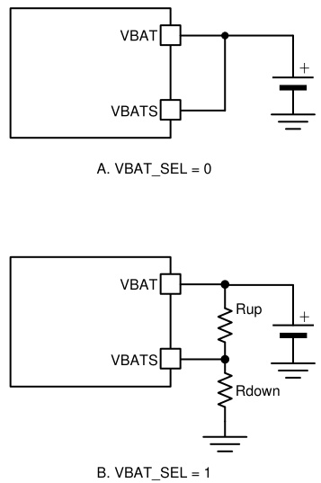  
Figure 1 Typical Charging Profile   
Figure 2 Battery voltage setting

# 8.1.1 Trickle Charge

The trickle charge voltage threshold can be set to $60 \%$ or $70 \%$ of 4.2V/cell by TRICKLE_SET bit. When in trickle charge phase, the charging current is reduced to a small value for the good of battery cells. If ICHAR_SEL bit is 0, the IBUS is reduced to $2 2 \%$ of the IBUS current limit set value; if ICHAR_SEL bit is 1, the IBAT is reduced to $10 \%$ of IBAT current limit set value.

If trickle charging phase is not needed, the user can set DIS_TRICKLE bit to 1 to disable it.

# 8.1.2 CC Charge (Constant Current Charge)

When cell voltage is higher than the trickle threshold, the IC charges the battery cells with constant current set by IBUS limit or IBAT limit, which are set respectively through IBUS_LIM_SET and IBAT_LIM_SET registers. The current limit value can be changed dynamically, and is also related to the current sense resistor and ratio bits. Please see Register Map section for details.

In charging mode, the IC regulates the current which reaches

When the battery cell voltage reaches $9 8 \%$ of the cell target voltage, the IC enters into CV charge phase. In this phase, the VBAT voltage is regulated at target value, and the charging current reduces gradually.

# 8.1.4 EOC (End of Charge)

When both of below voltage condition and current condition for EOC detection are satisfied, the IC enters into EOC phase, and informs the MCU through EOC interrupt bit.

1. the cell voltage is higher than $9 8 \%$ of set value   
2. the IBUS or IBAT current (decided by ICHAR_SEL bit) is lower than $1 / 1 0$ or $1 / 2 5$ (decided by EOC_SET bit) of its current limit value

In EOC phase, the IC can terminate the charging process or keep charging the battery cells, which can be set by DIS_TERM bit. If IC keeps charging, it regulates the battery cell voltage at set value.

# 8.1.5 Recharge

If the IC terminates the charging process after EOC is detected, the battery voltage may drop slowly due to leakage or operation current from battery cells. Once the VBAT voltage drops below $9 5 \%$ of the set voltage, the EOC bit is cleared, and the IC enters into CC charge phase and recharges the battery.

# 8.1.6 Self-adaptive Charging Current (VINREG)

The IC features dynamic power management. The allowed minimum VBUS operation voltage is VINREG threshold, which can be set by VINREG_SET register and VINREG_RATIO bit dynamically. During charging, if the IBUS charging current is higher than adapter’s current capability, the adapter will be overloaded and the VBUS voltage is pulled low. Once the IC detects the VBUS voltage drops at VINREG threshold, it reduces the charging current automatically and regulates the VBUS voltage at VINREG threshold.

# 8.1.7 Battery Impedance Compensation

The IC provides the function of battery impedance compensation. User can set the impedance through IRCOMP bits, then the VBAT target voltage phase is compensated as

Where,

VBAT_cmp is the compensated battery voltage target; VBAT_set is the originally set battery termination target; IBAT is the charging current at battery side; IRCOMP is the resistance compensation value set by IRCOMP bits; VCLAMP is the allowed maximum compensation value, fixed at 125mV.

User should carefully evaluate the real battery impedance. If the value set by IRCOMP bits is higher than the real value, it will cause over charge.

# 8.2 Discharging Mode

When EN_OTG bit is set to1, the IC enters into discharging mode. In discharging mode, the battery (VBAT) is discharged and the current flows from VBAT to VBUS.

If FB_SEL is set to 0, the VBUS output voltage is set internally, through VBUSREF_I_SET and VBUSREF_I_SET2 registers and the VBUS_RATIO bit. The VBUS can be changed dynamically, and the recommended VBUS voltage range is from 3V to 36V. When VBUS is lower than 10.24V, it is suggested to set the VBUS_RATIO to $5 \times$ and so the minimum changing step is 10mV/step; when VBUS is higher than 10.24V, VBUS_RATIO should be set to $1 2 . 5 \times$ , and the minimum changing step is 25mV/step.

If FB_SEL is set to 1, the VBUS voltage target is set externally, that is, by the resistor divider connected at FB pin, and can be calculated as below.

Even if VBUS is set externally, the user can still change the VBUS voltage dynamically by changing the reference voltage VBUSREF_E through VBUSREF_E_SET and VBUSREF_E_SET2 registers. The default VBUSREF_E is 1V, and recommended VBUSREF_E voltage range is from 0.7V to 2.048V.

Please see Register Map section for details.

The IBUS current limit and IBAT current limit are still functional in discharging mode and can be changed dynamically.

It is not allowed to set any of the current limits to 0A. Keep the minimum current limit above 0.3A.

# 8.2.1 Soft Start

The IC integrates soft-start control to generate VBUS voltage in discharging mode. When VBUS is lower than VSHORT (typ. 1V), both IBUS and IBAT current limits are fold back to $1 / 1 0$ of the setting value. Meanwhile, the IC ramps up the internal reference voltage gradually $( \sim 1 0 \mathsf { m s } )$ to avoid inrush current.

If there is a load at VBUS at the beginning of the startup, the IC may fail to boost the VBUS voltage beyond VSHORT due to the 1/10 current limits for both IBUS and IBAT. If startup with loading is required, user shall set the DIS_ShortFoldBack bit to 1 to disable the current limit fold back function. After startup, the user can set DIS_ShortFoldBack bit back to 0, so to enable this function for short circuit protection. See VBUS Short Protection section for details.

# 8.2.2 Slew Rate Setting

When the VBUS voltage is changed dynamically through reference voltage (VBUSREF_I_SET and VBUSREF_I_SET2 registers or VBUSREF_E_SET and VBUSREF_E_SET2 registers), the reference voltage change rate can be controlled through SLEW_SET bits. For example, the VBUS is set in internal way with $5 \times$ ratio, and the VBUSREF_ $\mathsf { I } = 1 \mathsf { V }$ at first $( \mathsf { V B U S } = 5 \mathsf { V } _ { . }$ ), then the user sets the VBUSREF_I voltage to $1 . 6 \mathsf { V }$ to get 8V output. If the slew rate is 2mV/ μs, the VBUS voltage will increase to 8V in $6 0 0 \mathrm { m V / \Omega }$ $2 \mathsf { m V } / \mu \ s = 3 0 0 \mu \mathrm { s }$ .

# 8.2.3 PFM Operation

The IC supports PFM operation in discharging mode by setting EN_PFM bit to 1. In PWM mode, the IC always works with constant switching frequency for the whole load range. This helps achieve the best output voltage performance, but the efficiency is low at light load condition because of the high switching loss.

In PFM mode, the IC still works with constant switching frequency under heavy load condition, but under light load condition, the IC automatically changes to pulse frequency modulation operation to reduce the switching loss. The efficiency can be improved under light load condition while output voltage ripple will be a little larger compared with PWM operation. Below figure shows the output voltage behavior of PFM mode.

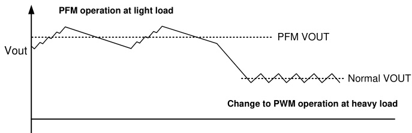  
Figure 3 PFM mode illustration

# 8.3 ADC for Voltage and Current Monitor

The IC integrates a 10-bit ADC, so the IC can monitor the VBUS/VBAT voltages and IBUS/IBAT current no matter in charging mode or discharging mode. Besides these, the IC provides an analog input: ADIN pin for 10-bit ADC sampling. The maximum voltage the ADC can sample at ADIN pin is 2.048V, and the sampling resolution is 2mV/step. The ADC function is enabled after AD_START bit is set to 1. When ADC is enabled in standby mode, the IC will 0.5mA\~1mA operation current. Please see Register Map section for details.

# 8.4 Power Path Management

The IC offers power path management function at PGATE and GPO pins. The PGATE pin can be used to drive PMOS connected at VBUS. The PGATE pin is connected to a $6 ~ \mathsf { k } \Omega$ pull down resistor internally when EN_PGATE is set to 1, and the maximum voltage between VBUS and PGATE is clamped at 7.35V; when EN_PGATE is set to 0, PGATE pin is connected to VBUS rail through a $2 0 ~ \mathsf { k } \Omega$ pull up resistor internally

The GPO pin is an open drain output, so external pull up resistor is needed. When GPO_CTRL bit is set to 0, GPO outputs high impedance; when GPO_CTRL is set to1, GPO is pulled down internally and the pull down resistance is $6 \mathsf { k } \Omega$ .

User can use PGATE pin and GPO pin to control the isolation MOSFETs between adapter input and USB output as shown in Typical Application Circuit. However, the MCU or system controller controls the bits through I2C interface, which takes time for communication, so the PMOS may not be turned on/off very quickly. In the application where the isolation PMOS needs to be controlled very fast, it is suggested to use the $1 / \mathsf { O }$ pins of MCU to control the PMOS on/off directly.

# 8.5 Phone Insert Detection

If connecting INDET pin to USB-A port as shown in Typical Application Circuit, the IC can detect the phone detection. Once the IC detects a phone is inserted, it sets the INDET interrupt bit to inform MCU. The INDET bit is cleared after it is read by MCU.

# 8.6 Adapter Attachment / Detachment Detection

If connecting ACIN pin to Micro-USB port as shown in Typical Application Circuit, the IC can detect the attachment / detachment of the adapter.

Once the ACIN pin voltage is higher than 3V, which means the adapter is inserted, the IC sets the AC_OK interrupt bit to inform MCU about the attachment. If the ACIN pin voltage is lower than 3V, which means the adapter is removed, the IC clears AC_OK bit to inform the MCU about the detachment.

# 8.7 Switching and Frequency Dithering

The IC switches in fixed frequency which can be adjusted through FREQ_SET bits. The switching dead time can also be set through DT_SET pins. Please see Register Map section for details.

The IC also offers frequency dithering function. This function can be enabled by setting EN_DITHER bit to 1. When the function is enabled, the switching frequency is not fixed, but varies within $+ 1 - 5 \%$ range. For example, if the switching frequency is set to 300kHz (FREQ_SET $= 0 1$ ), the frequency will change from 285kHz to 315kHz gradually and then back to 285kHz back and forth. The time it varies from the lowest to the highest frequency or from highest to lowest frequency can be controlled by a capacitor connected at PGATE/DITHER pin as below equation shows. For example, if 100nF capacitor is connected, the time is 1.2 ms.

$$
{ \sf T \_ d i t h e r } = \frac { 1 2 0 ~ { \sf m v } \times { \sf c } } { 1 0 ~ { \mu } { \sf A } }
$$

When EN_DITHER is set to 1, the PGATE driver function is disabled, and the PGATE/DITHER pin only operates for dithering function.

# 8.8 VCC Regulator and Driver Supply

The IC integrates a regulator which is powered by VBUS voltage and generates a 5V voltage at VCC pin with typically $2 5 ~ \mathsf { m A }$ driving capability.

When in Standby mode, the VCC voltage is not regulated and has very limited current capability. It is not suggested to use VCC in Standby mode.

The internal driving circuit is powered from VDRV pin, and user should provide a supply at VDRV pin to power the circuit. The user can connect VCC to VDRV directly, or connect an external power supply to VDRV. Besides the two ways, the IC offers a charge pump driver at CP pin, which can pump the VCC voltage to power VDRV pin. With charge pump circuit, the IC can regulate the VDRV voltage at 6V.

Charge pump is not recommended for VDRV. Consult local FAE if charge pump is used.

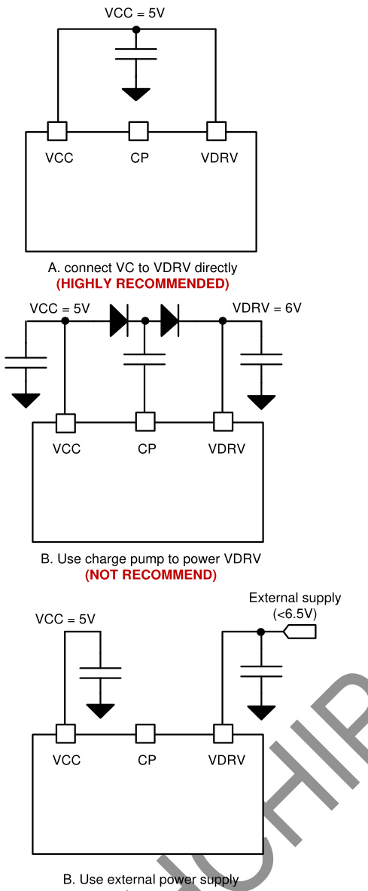  
Figure 4 Supply for VDRV

# 8.9 Standby Mode

When /CE signal is low and PSTOP signal is high, the IC enters into Standby mode. In this mode, the IC stops switching to save the quiescent current. The other functions are still valid, and the MCU can still control the IC through I2C. However, if ADC function is enabled in Standby mode, the quiescent current will be increased to $0 . 5 \mathsf { m A } \sim 1 \mathsf { m A }$ .

# 8.10 Shutdown Mode

When /CE signal is high, the IC enters into Shutdown mode. In this mode, the IC stops working and disables the I2C interface to save the power. When /CE signal is pulled low, the IC goes into Standby mode or Active mode. /CE signal is pulled down by internal resistor.

# 8.11 Protection

# 8.11.1 VBUS Over Voltage Protection

User can enabled / disable VBUS over voltage protection in discharging mode by DIS_OVP bit. When OVP is enabled, the IC stops switching when VBUS is higher than the target voltage by $10 \%$ .

# 8.11.2 VBAT Over Voltage Protection

The IC implements VBAT over voltage protection in both charging mode and discharging mode. Once the VBAT voltage is higher than target voltage by $1 0 \%$ , the IC stops switching.

# 8.11.3 VBUS Short Protection

In discharging mode, if the VBUS voltage is detected lower than VSHORT (typ. 1V), the IC sets the VBUS_SHORT interrupt bit to inform the MCU. In the same time, it reduces IBUS limits to $22 \%$ of the set values and IBAT limit to $10 \%$ of the set value at the same time to protect the IC. If DIS_ShortFoldBack bit is set to 1, the current limits will not be reduced.

# 8.11.4 Over Temperature Protection

When the IC detects the junction temperature is higher than $1 6 5 ^ { \circ } \mathrm { C }$ , the IC stops switching to protect the chip, and sets the OTP interrupt bit to inform the MCU. It resumes switching once the temperature drops below $1 5 ^ { \circ } C$ .

# 8.12 I2C and Interrupt

# 8.12.1 I2C Interface

The IC features I2C interface, so the MCU or controller can control the IC flexibly. The 7-bit I2C address of the chip is 0x74 (8-bit address is $\boldsymbol { 0 \times } \boldsymbol { \mathsf { E 8 } }$ for write command, $\boldsymbol { 0 \times } \boldsymbol { \mathsf { E 9 } }$ for read command). The SDA and SCL pins are open drain and must be connected to the positive supply voltage via a current source or pull-up resistor. When the bus is free, both lines are HIGH. The I2C interface supports both standard mode (up to 100kbits) and fast mode (up to $4 0 0 \mathsf { k }$ bits with $5 \kappa \Omega$ pull up resistor at SCL pin and SDA pin respectively).

# 8.12.1.1 Data Validity

The data on the SDA line must be stable during the HIGH period of the clock. The HIGH or LOW state of the data line can only change when the clock signal on the SCL line is LOW. One clock pulse is generated for each data bit transferred.

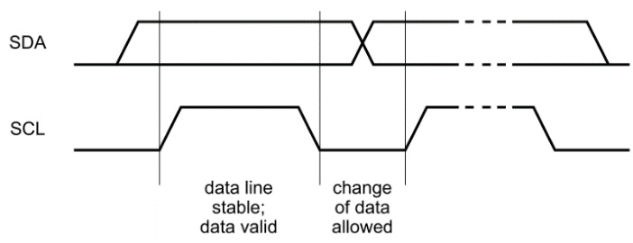  
Figure 5 Bit transfer on the I2C bus

# 8.12.1.2 START and STOP Conditions

All transactions begin with a START (S) and are terminated by a STOP (P). A HIGH to LOW transition on the SDA line while SCL is HIGH defines a START condition. A LOW to HIGH transition on the SDA line while SCL is HIGH defines a STOP condition.

START and STOP conditions are always generated by the master. The bus is considered to be busy after the START condition. The bus is considered to be free again a certain time after the STOP condition.

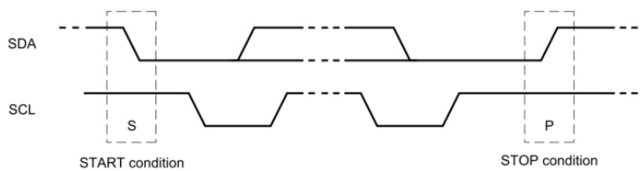  
Figure 6 START and STOP conditions

# 8.12.1.3 Byte Format

Every byte put on the SDA line must be eight bits long. The number of bytes that can be transmitted per transfer is unrestricted. Each byte must be followed by an Acknowledge bit. Data is transferred with the Most Significant Bit (MSB) first. If a slave cannot receive or transmit another complete byte of data until it has performed some other function, for example servicing an internal interrupt, it can hold the clock line SCL LOW to force the master into a wait state. Data transfer then continues when the slave is ready for another byte of data and releases clock line SCL.

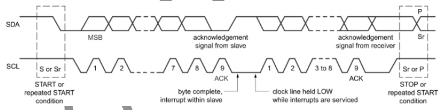  
Figure 7 Data transfer on the I2C bus

# 8.12.1.4 Acknowledge (ACK) and Not Acknowledge (NACK)

The acknowledge takes place after every byte. The acknowledge bit allows the receiver to signal the transmitter that the byte was successfully received and another byte may be sent. During data is transferred, the master can either be the transmitter or the receiver. No matter what it is, the master generates all clock pulses, including the acknowledge ninth clock pulse.

The transmitter releases the SDA line during the acknowledge clock pulse so the receiver can pull the SDA line LOW and it remains stable LOW during the HIGH period of this clock pulse.

When SDA remains HIGH during this ninth clock pulse, this is defined as the Not Acknowledge signal. The master can then generate either a STOP condition to abort the transfer, or a repeated START condition to start a new transfer.

# 8.12.1.5 The slave address and R/W bit

Data transfers follow the format shown in below. After the START condition (S), a slave address is sent. This address is seven bits long followed by an eighth bit which is a data direction bit (R/W) — a ‘zero’ indicates a transmission (WRITE), a ‘one’ indicates a request for data (READ). A data transfer is always terminated by a STOP condition (P) generated by the master. However, if a master still wishes to communicate on the bus, it can generate a repeated START condition (Sr) and address another slave without first generating a STOP condition.

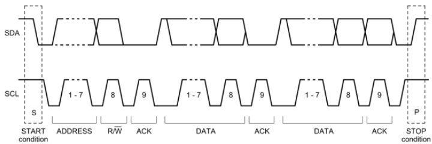  
Figure 8 A complete data transfer

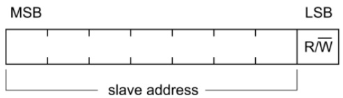  
Figure 9 The first byte after the START procedure

# 8.12.1.6 Single Read and Write

S Slave Address W(0) ACK(0) Reg Address ACK(0) Data ACK(0) F (7 bits) (8 bits) (8 bits) from master to slave from slave to mater

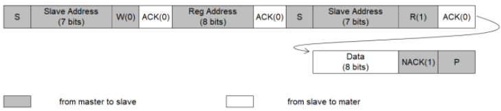  
Figure 10 Single Wite   
Figure 11 Single Read

If the register address is not defined, the charger IC send back NACK and go back to the idle state.

# 8.12.1.7 Multi-Read and Multi-Write

The IC supports multi-read and multi-write for continuous registers.

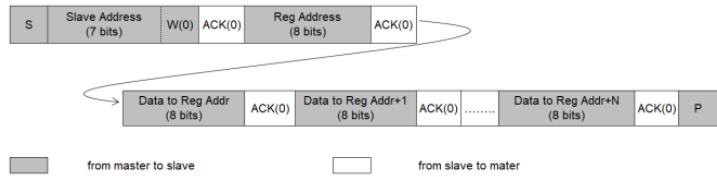  
Figure 12 Multi-W rite

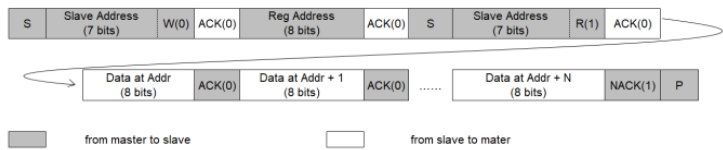  
Figure 13 Multi-Read

# 8.12.2 Interrupt

When AC_OK/VBUS_SHORT/OTP/EOC is set to 1, or clear to 0, the IC sends an interrupt pulse as below at INT pin to inform MCU. But when INDET only is set to 1, the IC sends an interrupt pulse. It is summarized as below:

<html><body><table><tr><td>Status Signal</td><td>Interrupt Triggering Mechanism</td></tr><tr><td>Reserved</td><td></td></tr></table></body></html>

  
Figure 14 Interrupt pulse at INT pin

<html><body><table><tr><td>AC_OK</td><td>Rising edge or falling edge triggers 1ms_pulse INT</td></tr><tr><td>INDET2</td><td>Only rising edge triggers 1ms_pulse INT.</td></tr><tr><td>INDET1</td><td>Only rising edge triggers 1ms_pulse INT.</td></tr><tr><td>VBUS_SHORT</td><td>Logic high triggers continuous INT.</td></tr><tr><td>OTP</td><td>Rising edge or falling edge triggers 1ms pulse INT</td></tr><tr><td>EOC</td><td>Rising edge or falling edge triggers 1ms_pulse INT</td></tr><tr><td>Reserved</td><td></td></tr></table></body></html>

The interrupt pulse at INT pin is as follow:

INT X 1ms D

The INDET bit is read and clear type. Except INDET, all other bits in Status register represent the real time status. User can mask the interrupt output of any bit by setting its corresponding bit in Mask register. When the mask bit is set, the corresponding status bit is still set, but the IC doesn’t send the interrupt at INT pin.

# 9 Application Information

# 9.1 Capacitor Selection

The switching frequency of the IC is in the range of $1 5 0 \mathsf { k H z } \sim$ 450kHz. Since MLCC ceramic capacitor has good high frequency filtering with low ESR, above $6 0 \mu \mathsf { F }$ X5R or X7R capacitors with higher voltage rating then operating voltage with margin is recommended. For example, if the highest operating Vin/Vout voltage is 12V, select at least 16V capacitor and to secure enough margin, 25V voltage rating capacitor is recommended.

The high capacitance polymer capacitor or tantalum capacitor can be used for input and output but capacitor voltage rating must be higher than the highest operating voltage with enough margin. The high frequency characteristics of these capacitors are not as good as ceramic capacitor, so at least $1 0 \mu \mathsf { F }$ ceramic capacitor should be placed in parallel to reduce high frequency ripple.

# 9.2 Inductor Selection

$2 . 2 ~ \mu \ H$ to $4 . 7 \mu \mathsf { H }$ inductor is recommended for loop stability. The peak inductor current in discharging mode can be calculated as

$$
\begin{array} { r l } & { \mathrm { I L \_ p e a k } = 1 \mathsf { B A T } + \frac { \mathsf { V B A T } \cdot ( \mathsf { V B U S - V B A T } \cdot \mathsf { n } ) } { 2 \cdot \mathsf { f s w } \cdot \mathsf { L } \cdot \mathsf { V B A T } \cdot \mathsf { n } } \left( \mathsf { V B U S \geq V B A T } \right) } \\ & { \mathrm { I L \_ p e a k } = 1 \mathsf { B U S } + \frac { \mathsf { V B U S } \cdot ( \mathsf { V B A T } \cdot \mathsf { V B U S } ) } { 2 \cdot \mathsf { f s w } \cdot \mathsf { L } \cdot \mathsf { V B A T } \cdot \mathsf { n } } \left( \mathsf { V B U S < V B A T } \right) } \end{array}
$$

where IBAT is the battery current at VBAT side, and can be calculated as

$\eta$ is the power conversion efficiency. User can use $90 \%$ for calculation.

fsw is the switching frequency

L is the inductor value

The peak inductor current in charging mode can be calculated as

where IBAT is the battery charging current at VBAT side, and can be calculated as

$$
| \mathsf { B A T } \ = \ \frac { \mathsf { V B U S } \cdot | \mathsf { B U S } \cdot \boldsymbol { \eta } } { \mathsf { V B A T } }
$$

$\eta$ is the power conversion efficiency. User can use $90 \%$ for calculation.

fsw is the switching frequency

L is the inductor value

When selecting inductor, the inductor saturation current must be higher than the peak inductor current with enough margin $2 0 \%$ margin is recommended). The rating current of the inductor must be higher than the battery current.

The inductor DC resistance value (DCR) affects the conduction loss of switching regulator, so low DCR inductor is recommended especially for high power application. The conductor loss of inductor can be calculated roughly as

IL is the average value of inductor current, and it equals to IBAT or IBUS.

Besides DC power loss, there are also inductor AC winding loss and inductor core loss, which are related to inductor peak current. Normally, higher peak current causes higher AC loss and core loss. The user can consult with the inductor vendor to select the inductors which have small ESR at high frequency and small core loss.

# 9.3 Current Sense Resistor

The RSNS1 and RSNS2 are current sense resistors. $1 0 ~ \mathsf { m } \Omega$ should be used for RSNS1 to sense IBUS current, $5 ~ \mathsf { m } \Omega$ or 10 mΩ used for RSNS2 to sense IBAT current $1 0 ~ \mathsf { m } \Omega$ supports higher battery current limit accuracy, and $5 ~ \mathsf { m } \Omega$ supports higher efficiency). Resistor of $1 \%$ or higher accuracy and low temperature coefficient is recommended.

Note: If the user wants to use other resistor values, please contact factory for support.

The resistor power rating and temperature coefficient should be considered. The power dissipation is roughly calculated as ${ \mathsf { P } } { = } { \mathsf { I } } ^ { 2 } { \mathsf { R } }$ , and I is the highest current flowing through the resistor. The resistor power rating should be higher than the calculated value.

Normally the resistor value is varied if the temperature increased and the variation is decided by temperature coefficient. If high accuracy of current limit is required, select lower temperature coefficient resistor as much as possible.

# 9.4 MOSFET Selection

The IC integrates two power MOSFETs, and the user should add two external power MOSFETs at VBAT side.

The $\mathsf { V } _ { \mathsf { D S } }$ of MOSFET should be higher than the highest operating voltage with enough margin (recommend more than 10V higher). For example, if the highest operating voltage is $2 0 \vee$ , at least 30V rated VDS MOSFET should be selected; If the highest operating voltage is 24V, 40V VDS voltage rating should be selected.

The $\mathsf { V } _ { \mathsf { G S } }$ voltage rating of MOSFET should be selected higher than 8V. Considering PCB parasitic parameters during operation, MOSFET $\mathsf { V } _ { \mathsf { G S } }$ voltage might be higher than VDRV voltage due to transient overshoot, so 10V VGS is recommended to secure sufficient margin.

The MOSFET current ID should be higher than the highest battery current with enough margin.

To ensure the sufficient current capability in relatively high temperature circumstance, the current rate at ${ \mathsf { T } } _ { \mathsf { A } } { = } 7 0 ^ { \circ } \mathsf { C }$ or $\mathsf { T } _ { \mathsf { C } }$ $= \ 1 0 0 ^ { \circ } { \mathsf C }$ should be considered. In addition, the power dissipation value $\mathsf { P } _ { \mathsf { D } }$ should also be considered and higher $\mathsf { P } _ { \mathsf { D } }$ is better in applications. Make sure that MOSFET power consumption must not exceed $\mathsf { P } _ { \mathsf { D } }$ value.

The MOSFET $\mathsf { R o s } _ { ( \mathsf { O N } ) }$ and input capacitor CISS impact power efficiency directly. Typically, lower RDS(ON) MOSFET has higher CISS. The RDS(ON) is related to conduction loss. Higher RDSON results in higher conduction loss, thus lower efficiency and higher thermal dissipation; the CISS is related to MOSFET switch on/off time, and longer on/off time results in higher switching loss and lower efficiency. The proper MOSEFT should be selected based on tradeoff between the RDS(ON) and CISS.

If high CISS MOSFET is selected, the switching on and off time become longer, then the dead time should be adjusted to avoid simultaneous turn on for both high side and low side MOSFETs.

# 9.5 Driver Resistor and SW Snubber Circuit

To adjust MOSFET switching time and switching overshoot for EMI debugging, it is recommended to add series resistor (0603 size) for gate driving signal (HD1 to MOS gate, LD1 to MOS gate, LD2 to MOS gate, and HD2 to MOS gate), and RC snubber (0603 size) circuit at SWx, as shown below.

The driver resistor should be placed near MOS. At first, use 0Ω resistors; if switching overshoot is big, increase the resistor value to slow down the switching speed. It is suggested to keep the resistor value < 10 Ω. While the switching speed gets slower, the default dead time may not be enough to avoid overshoot of the power MOSFETs. So if higher than 10Ω is needed, user should increase the dead time if necessary.

The RC snubber circuit at SWx node is also helpful in absorbing the high frequency spike at SWx node, so to improve EMC performance. User can leave RC components as NC at the beginning, and adjust the value to improve the EMC performance if necessary. Normally user can try $2 . 2 \Omega$ and 1nF for the snubber. If EMC should be improved further, reduce the resistor value (like 1 Ω or even lower) and increase the capacitor value (like 2.2nF or even higher).

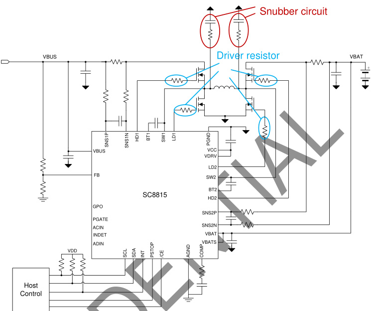  
Figure 15 Driver resistor and snubber circuit

# 9.6 Layout Guide

The 1uF capacitors connected at VBUS/VBAT/VCC/VDRV pins should be placed near the IC, and their ground connection to the ground pins should be as short as possible.

# a. component(s) on schematic:

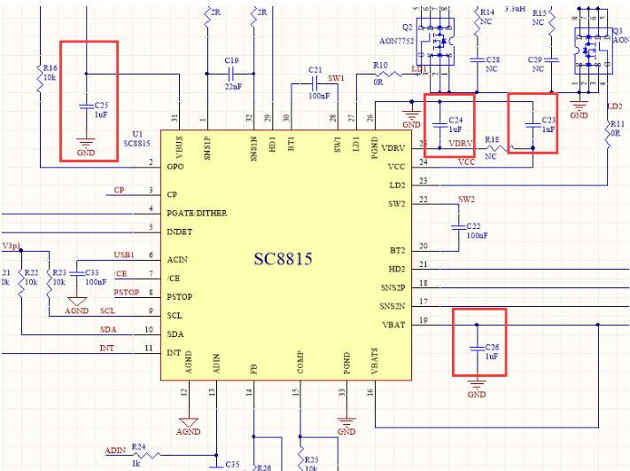  
Figure 16 Schematic

b. Layout example: put the three capacitors near IC on the top layer. Connect the capacitors to each pin on the same layer, and connect the capacitors to ground pour through vias.

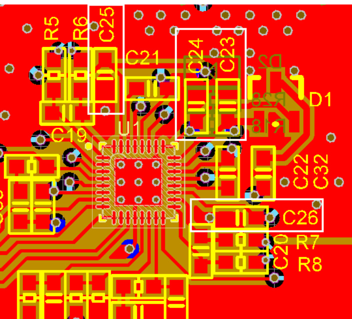  
Figure 8 Top layer view

2. Put IBUS current sense resistor, MOSFETs and bulk capacitor at VBUS side as close as possible. And the low side MOSFET and bulk capacitors should be very close to PGND pins. Between current sense resistor and high side MOS, add a 100nF 0402 capacitor to PGND. It is helpful to suppress high frequency noise. Put it very close to MOS and PGND pins.

# a. component(s) on schematic

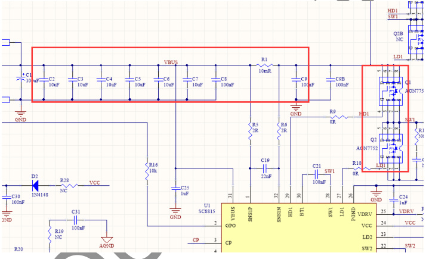  
Figure 9 Schematic

Layout example: put all these components on the top layer as a group, and the VBUS and PGND power paths should be as wide as possible. The low side MOS, 100nF capacitor and the bulk capacitors connected to PGND pins through ground pour on both top layer and bottom layer.

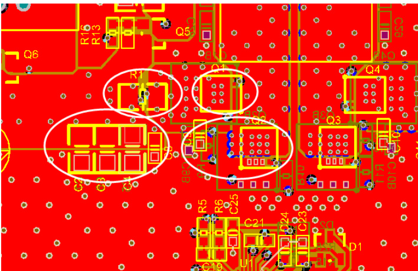  
Figure 10 Top layer view

3. Put IBAT current sense resistor, MOSFETs and bulk capacitor at VBAT side as close as possible. And the low side MOSFET and bulk capacitors should be very close to PGND pins. Between current sense resistor and high side MOS, add a 100nF 0402 capacitor to PGND. It is helpful to suppress high frequency noise. Put it very close to MOS and PGND pins.

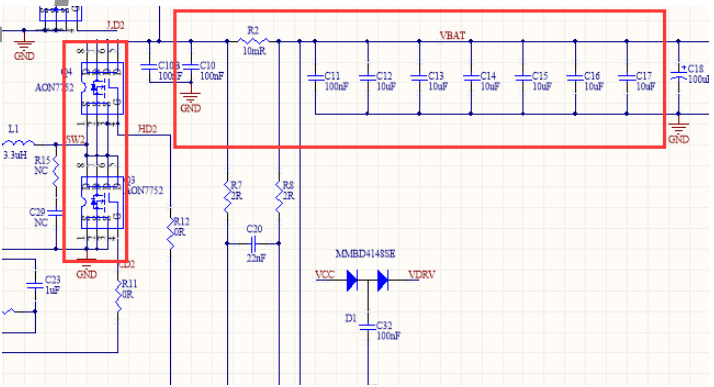  
component(s) on schematic   
Figure 11 Schematic

b. Layout example: put all these components on the top layer as a group, and the VBAT and PGND power paths should be as wide as possible. The low side MOS, 100nF capacitor and the bulk capacitors connected to PGND pins through ground pour on both top layer and bottom layer.

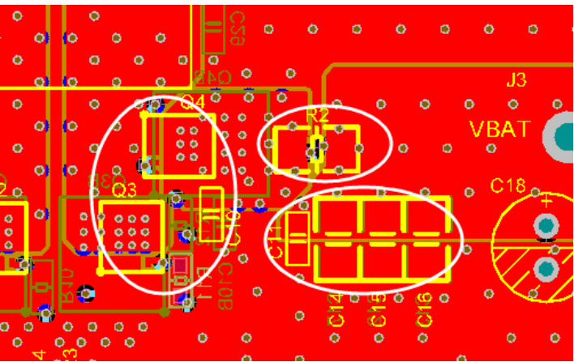  
Figure 12 Top layer view

4. The driver signals (LD1 / HD1 / SW1 / LD2 / HD2 / SW2) as shown below should be routed with wide traces (≥ 15 mil). The driver resistors should be placed near MOS. The HDx and SWx should be routed in parallel, close to each other; the LDx should be routed in parallel with PGND traces $( \geq 1 5 { \mathrm { ~ m i l } } )$ or close to PGND pour. There should be wide space filled with PGND between LDx and HDx and also wide space from LDx to SWx to avoid interference.

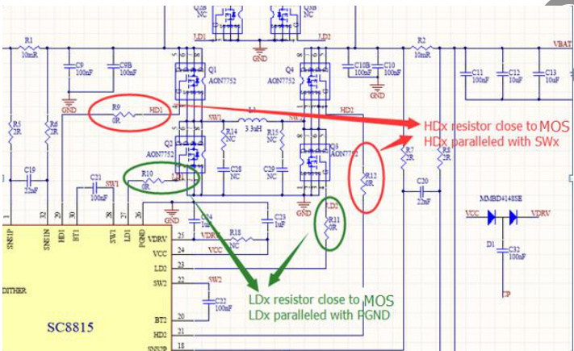  
Figure 13 Schematic

5. The current sense traces should be connected to the current sense resistor’s pads in Kelvin sense way as below, and routed in parallel (differential routing), and add filter for each current sense near the IC.

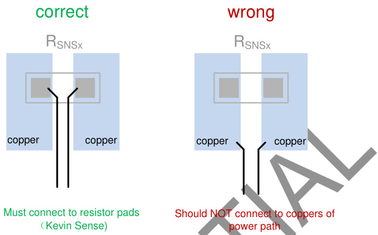  
Figure 14 Current sense

# a. component(s) on schematic

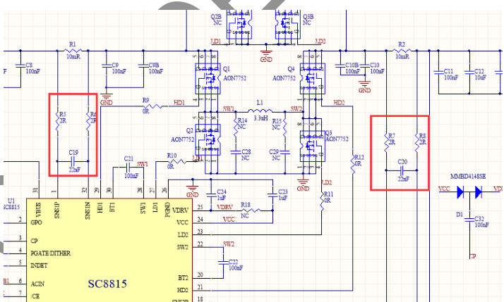  
Figure 15 Schematic

b. Layout example: The current sense resistor R1 and R2 should be placed near the power MOSFETs, so it might be far from the IC. The sense filter should be placed near the IC. The traces can be routed on other layer $3 ^ { \mathsf { r d } }$ layer in this example), but should route the traces in parallel (differential way), far away from switching signals and isolated them with PGND pour.

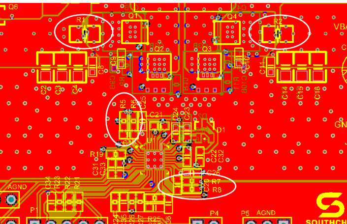  
Figure 16 Top layer view

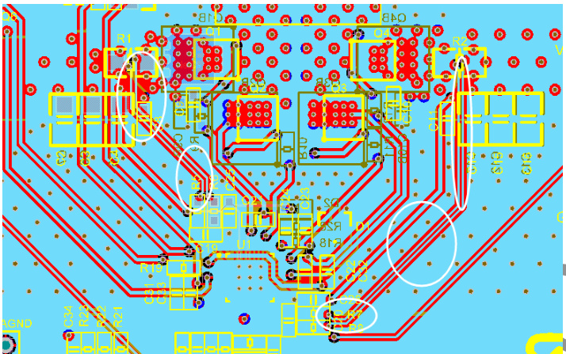  
Figure 17 Middle-2 layer view

6. The components for analog signals (e.g. FB resistor divider, COMP pin components, etc) should be placed near IC, and connect to AGND (analog ground) pin. Then connect the AGND pin and PGNDs at the PGND pad under IC. Place vias at PGND pad for better thermal dissipation.

a. component(s) on schematic b. Layout example: analog components are placed near the IC, and the AGND are connected with PGND at PGND pad.

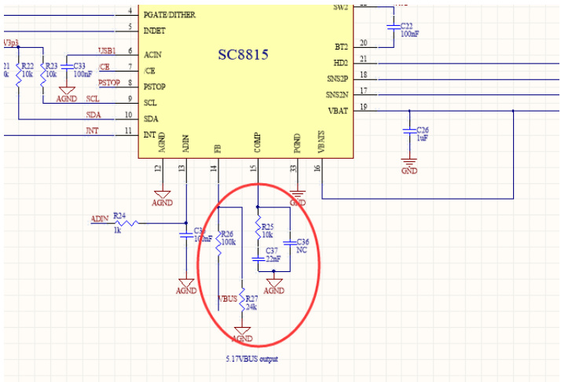  
Figure 18 Schematic

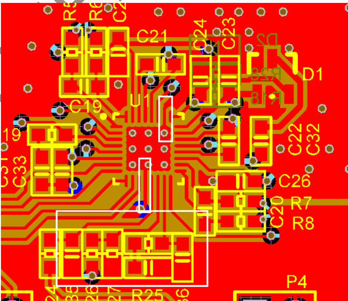  
Figure 19 Top layer view

# 10 Register Map

7-bit address: 0x74; 8-bit address: $\boldsymbol { 0 \times } \boldsymbol { \mathsf { E 8 } }$ for write command; $\boldsymbol { 0 \times } \boldsymbol { \mathsf { E 9 } }$ for read command.

IA

<html><body><table><tr><td rowspan="2">Addr</td><td rowspan="2">Register</td><td rowspan="2">Type</td><td rowspan="2">Default value @POR</td><td rowspan="2">Bit 7</td><td rowspan="2">Bit 6</td><td rowspan="2">Bit 5</td><td rowspan="2">Bit 4 Bit 3</td><td colspan="2" rowspan="2">Bit 2</td><td rowspan="2">Bit 1</td><td rowspan="2">Bit 0</td></tr><tr><td></td><td></td></tr><tr><td> O0H</td><td>VBAT_SET</td><td>RW</td><td> 0000 0001</td><td colspan="2">IRCOMP</td><td>VBAT_SEL</td><td colspan="2">CSEL</td><td>VCELL_SET</td><td></td><td></td></tr><tr><td>01H</td><td>VBUSREF_L_SET</td><td>R/W</td><td> 0011 0001</td><td colspan="2"></td><td colspan="5">VBUSREF_L_SET</td><td></td><td></td></tr><tr><td>02H</td><td>VBUSREF_I_SET2</td><td>R/W</td><td>11xx xxxx</td><td colspan="2">VBUSREF_I_SET _2</td><td></td><td colspan="5">Reserved</td></tr><tr><td> 03H</td><td>VBUSREF_E_SET</td><td>RW</td><td>0111 1100</td><td colspan="2"></td><td>VBUSREF_E SET</td><td colspan="5"></td></tr><tr><td> 04H</td><td>VBUSREF_E_SET2</td><td>R/W</td><td>11xx xxxx</td><td colspan="2">VBUSREF_E_SET_2</td><td></td><td colspan="5"> Reserved</td></tr><tr><td> 05H</td><td>IBUS_LIM_SET</td><td>R/W</td><td>1111 1111</td><td colspan="9">iBUS_LIM setting</td></tr><tr><td>06H 07H</td><td>IBAT_LIM_SET VINREG_SET</td><td>R/W R/W</td><td>1111 1111 0010 1100</td><td colspan="6">JBAT_LIM setting VINREG voltage setting</td><td></td><td></td></tr><tr><td> O8H</td><td>RATIO</td><td>RW</td><td> 0011 1000</td><td colspan="6">Reserved IBAT RATIO</td><td>VBAT_MON_</td><td>VBUS_RATIO</td></tr><tr><td></td><td></td><td></td><td></td><td></td><td></td><td></td><td colspan="2">IBUS_RATIO</td><td></td><td>RATIO DT_SET</td><td></td></tr><tr><td>09H OAH</td><td>CTRL0_SET CTRL1_SET</td><td>R/W R/W</td><td>0000 0100 0000 0001</td><td>EN_OTG ICHAR_SEL</td><td>Reserved DIS_TRICKLE</td><td>Reserved VINREG_RATIO DIS_TERM FB_SEL</td><td>TRICKLE_SET</td><td>FREQ_SET DIS_OVP</td><td></td><td> Reserved</td><td> Reserved</td></tr><tr><td>0BH</td><td>CTRL2_SET</td><td>R/W</td><td> 0000 0001</td><td></td><td>Reserved</td><td></td><td>FACTORY</td><td></td><td>EN_DITHER</td><td>SLEW_SET</td><td></td></tr><tr><td>OCH</td><td>CTRL3_SET</td><td>RW</td><td> 0000 0010</td><td>EN_PGATE</td><td>GPO_CTRL AD_START</td><td>ILIM_BW_SEL</td><td>LOOP_SET</td><td></td><td>DIS_ShortFoldBack</td><td>EOC_SET</td><td>EN_PFM</td></tr><tr><td>ODH</td><td>VBUS_FB_VALUE</td><td>R</td><td> 0000 0000</td><td colspan="2"></td><td></td><td>VBUS_FB_value</td><td></td><td></td><td></td><td></td></tr><tr><td>OEH</td><td>VBUS_FB_VALUE2</td><td>R</td><td> 0000 0000</td><td colspan="8">VBUS_FB_value2 Reserved</td></tr><tr><td>OFH</td><td>VBAT_FB_VALUE</td><td>R</td><td> 0000 0000</td><td colspan="8">VBAT_FB_value</td></tr><tr><td>10H</td><td>VBAT_FB_VALUE2</td><td>R</td><td> 0000 0000</td><td colspan="8">VBAT_FB_alue2 Reserved</td></tr><tr><td>11H</td><td>IBUS_VALUE</td><td>R</td><td> 0000 0000</td><td colspan="8"></td></tr><tr><td>12H</td><td>IBUS_VALUE2</td><td>R</td><td> 0000 0000</td><td colspan="8">IBUS_value2</td></tr><tr><td>13H</td><td>IBAT_VALUE</td><td>R</td><td> 0000 0000</td><td colspan="8">IBAT_value</td></tr><tr><td>14H 15H</td><td>IBAT_VALUE2 ADIN_VALUE</td><td>R R</td><td colspan="2">0000 0000 IBAT_value2</td><td colspan="5"> Reserved</td><td></td><td></td></tr><tr><td>16H</td><td>ADIN_VALUE_2</td><td>R</td><td>0000 0000 0000 0000</td><td colspan="2">ADIN_value2</td><td colspan="5">ADIN_value</td></tr><tr><td>17H</td><td> STATUS</td><td>R</td><td> 0000 0000</td><td colspan="2">Reserved AC_OK</td><td>INDET Reserved VBUS_SHORT OTP</td><td colspan="2"> Reserved</td><td></td><td>EOC</td><td> Reserved</td></tr><tr><td>18H</td><td> Reserved</td><td>R RW</td><td> 0000 0000</td><td></td><td></td><td></td><td colspan="2"> Reserved</td><td></td><td></td><td>Reserved</td></tr><tr><td>19H</td><td>MASK</td><td></td><td>1000 0000</td><td>Reserved</td><td>AC_OK_Mask INDET_Mask</td><td>Reserved</td><td colspan="2">VBUS_SHORT_ Mask</td><td>OTP_Mask</td><td>EOC_Mask</td><td></td></tr><tr><td>1AH</td><td> Reserved</td><td>RW RW</td><td>0000 0000 xxx0 0000</td><td colspan="8"> Reserved</td></tr><tr><td>1BH</td><td>Reserved</td><td></td><td colspan="8"></td></tr></table></body></html>

S

Table 1 0x00H VBAT_SET Register   

<html><body><table><tr><td>Bit</td><td>Mode</td><td>Bit Name</td><td>Default value @por</td><td>Description</td><td>Notes</td></tr><tr><td>7-6</td><td>R/W</td><td>IRCOMP</td><td>00</td><td>Battery IR compensation setting: 00: 0 mQ (default)</td><td rowspan="2">Set this bit during PSTOP pin is high</td></tr><tr><td></td><td></td><td></td><td></td><td>01: 20 mQ 10: 40 mQ 11: 80 mQ</td></tr><tr><td>5</td><td>R/W</td><td>VBAT_SEL</td><td>0</td><td>VBAT voltage setting selection: 0: internal setting (default)</td><td colspan="2">Set this bit during PSTOP pin is high</td></tr><tr><td>4-3</td><td>R/W</td><td>CSEL</td><td>00</td><td>1: external setting Battery cell selection, only valid for internal VBAT voltage setting 00: 1S battery (default) 01: 2S battery 10: 3S battery</td><td colspan="2">Set this bit during PSTOP pin is high</td></tr><tr><td>2-0</td><td>R/W</td><td>VCELL_SET</td><td>001</td><td>11: 4S battery Battery voltage setting per cell, only valid for internal VBAT voltage setting 000: 4.1V 001: 4.2V (default) 010: 4.25V 011: 4.3V 100: 4.35V 101: 4.4V 110: 4.45V</td><td>Set this bit PSTOP is high during</td><td>pin</td></tr></table></body></html>

Table 2 0x01H VBUSREF_I_SET Register   

<html><body><table><tr><td>Bit</td><td>Mode</td><td>Bit Name</td><td>Default value @por</td><td>Description</td><td>Notes</td></tr><tr><td>7-0</td><td>R/W</td><td>VBUSREF_I_ SET</td><td>0011 0001</td><td>Reference voltage programming for internal VBUS voltage setting.. When FB_SEL = 0 (internal VBUS setting), set the highest 8-bit of the. reference voltage for VBUS (total 10-bit programming).. The internal reference voltage is calculated as.</td><td></td></tr></table></body></html>

Copyright $\circledcirc$ 2017, Southchip Semiconductor Technology (Shanghai) Co.,Ltd.

<html><body><table><tr><td rowspan="6"></td><td rowspan="6"></td><td rowspan="6"></td><td></td></tr><tr><td>0011 0001: 49 (default)</td></tr><tr><td></td></tr><tr><td>1111 1111: 255</td></tr><tr><td>The default reference voltage is (4 x 49 +3+1) x 2 mV = 400 mV; the</td></tr><tr><td>default VBUS output voltage with FB_SEL = 0 is 400mV x 12.5 = 5V</td><td></td></tr></table></body></html>

Table $3 0 \times 0 2 H$ VBUSREF_I_SET_2 Register   

<html><body><table><tr><td rowspan="2">Bit</td><td rowspan="2">Mode</td><td rowspan="2">Bit Name</td><td rowspan="2">Default value @pOr 11</td><td>Description</td><td rowspan="2">Notes</td></tr><tr><td>Reference voltage programming for internal VBUS voltage setting.</td></tr><tr><td>7-6</td><td>R/W VBUSREF_I_ SET2</td><td></td><td></td><td>When FB_SEL = 0 (internal VBUS setting), set the lowest 2-bit of the reference voltage for VBUS (total 10-bit programming). The internal reference voltage is calculated as. VBUSREF_1 = (4 x VBUSREF_i_SET+ VBUSREF_I_SET2 + 1) x 2 mV The VBUS output voltage is calculated as. VBUS = VBUSREF_Ix VBUS_RATIO VBUSREF_I_SET2 range: 0 ~ 3 00: 0</td><td></td></tr><tr><td>5-0</td><td>Reserved</td><td></td><td>XX XxxX</td><td>10: 2 11: 3 (default)</td><td></td></tr></table></body></html>

Table 4 0x03H VBUSREF_E_SET Register   
Copyright $\circledcirc$ 2017, Southchip Semiconductor Technology (Shanghai) Co.,Ltd.   

<html><body><table><tr><td>Bit</td><td>Mode</td><td>Bit Name</td><td>Default value @POR</td><td>Description</td><td>Notes</td></tr><tr><td>7-0</td><td>R/W VBUSREF E SET SOUT</td><td></td><td>0111 1100</td><td>Reference voltage programming for external VBUS voltage setting. When FB_SEL = 1 (external VBUS setting), set the highest 8-bit of the reference voltage for VBUS (total 10-bit programming). The external reference voltage is calculated as. VBUSREF_E = (4 x VBUSREF_E_SET+VBUSREF_E_SET2+1) x 2mV The VBUS output voltage is calculated as. RUP VBUS = VBUSREF_E x (1+ RDOWM</td><td></td></tr></table></body></html>

<html><body><table><tr><td></td><td>0111 1100: 124 (default) 1111 1111: 255</td></tr></table></body></html>

4

Table $5 0 \times 0 4  H$ VBUSREF_E_SET_2 Register   

<html><body><table><tr><td>Bit 7-6</td><td>Mode R/W SET2</td><td>Bit Name VBUSREF_E_</td><td>Default value @por 11</td><td>Description Reference voltage programming for external VBUS voltage setting.</td><td>Notes</td></tr><tr><td></td><td></td><td></td><td></td><td>When FB_SEL = 1 (external VBUS setting), set the lowest 2-bit oft the reference voltage for VBUS (total 10-bit programming). The external reference voltage is calculated as. VBUSREF_E = (4 x VBUSREF_E_SET+VBUSREF_E_SET2+1) x 2mV The VBUS output voltage is calculated as RUP VBUS = VBUSREF_E x (1+ RDOWM VBUSREF_E_SET2 range: 0 ~ 3 00: 0 01:1 10: 2</td><td></td></tr><tr><td>5-0</td><td>Reserved</td><td></td><td>XX XxXX</td><td>11: 3 (default)</td><td></td></tr></table></body></html>

# Table 6 0x05H IBUS_LIM_SET Register

<html><body><table><tr><td>Bit</td><td>Mode</td><td>Bit Name</td><td>Default value @pOr</td><td>Description</td><td>Notes</td></tr><tr><td>7-0</td><td>R/W</td><td>IBUS_LIM_SE T SOUTF</td><td>11111111</td><td>Set IBUS current limit, which is valid for both charging and discharging modes. 256 x IBUS_RATIO x10 mQ RS1 is the current sense resistor at VBUS side. IBUS_LIM_SET range: 0 ~ 255 0000 0000: 0 IBUS_LIM (A) -(IBUS_LIM_SET +1) </td><td>IBUS_LIM_S ET must be >=300mA</td></tr></table></body></html>

Table 7 0x06H IBAT_LIM_SET Register   

<html><body><table><tr><td>Bit</td><td>Mode</td><td>Bit Name</td><td>Default value @por</td><td>Description</td><td>Notes</td></tr><tr><td>7-0</td><td>R/W</td><td>IBAT_LIM_SE T</td><td>1111 1111</td><td>Set IBAT current limit, which is valid for both charging and discharging modes. 10 mQ</td><td>IBAT_LIM_S ET must. be >=300mA</td></tr><tr><td rowspan="5"></td><td></td><td></td><td></td><td>IBAT_LIM_SET+1 IBAT_LIM (A) = x IBAT_RATIO x 256 RS2</td><td></td></tr><tr><td></td><td></td><td></td><td>RS2 is the current sense resistor at VBAT side. ENTIA</td><td></td></tr><tr><td></td><td></td><td></td><td>IBAT_LIM_SET range: 0 ~ 255</td><td></td></tr><tr><td></td><td></td><td></td><td>0000 0000: 0</td><td></td></tr><tr><td></td><td></td><td></td><td>0000 0001: 1</td><td></td></tr><tr><td rowspan="4"></td><td></td><td></td><td></td><td>0000 0010: 2</td><td></td></tr><tr><td></td><td></td><td></td><td></td><td></td></tr><tr><td></td><td></td><td></td><td>1111 1111: 255 (default)</td><td></td></tr><tr><td></td><td></td><td></td><td>E.g., if RS2 = 10 mQ, the default IBAT current limit is. (255+1)/256 x 12 x 10 mQ / 10 mQ =12 A</td><td></td></tr></table></body></html>

Table 8 0x07H VINREG_SET Register  

<html><body><table><tr><td>Bit</td><td>Mode</td><td>Bit Name</td><td>Default value. @por</td><td>Description</td><td>Notes</td></tr><tr><td>7-0</td><td>R/W</td><td>VINREG_SET</td><td>0010 1100 0000 0000: 0 JTHCH</td><td>Set VINREG reference voltage for charging mode. VINREG = (VINREG_SET+1) x VINREG_RATIO (mV) VINREG_SET range: 0 ~ 255</td><td></td></tr></table></body></html>

Table 9 0x08H RATIO Register   

<html><body><table><tr><td rowspan="2">Bit</td><td rowspan="2">Mode</td><td rowspan="2">Bit Name</td><td rowspan="2">Default value @pOR</td><td rowspan="2">Description</td><td rowspan="2">Notes</td></tr><tr><td></td></tr><tr><td>7-6</td><td>R/W</td><td>Reserved</td><td>00</td><td>Internal use. Don't overwrite this bit.</td><td></td></tr><tr><td>5</td><td>R/W</td><td> Reserved</td><td>1</td><td>Internal use. Don't overwrite this bit.</td><td></td></tr></table></body></html>

<html><body><table><tr><td>4</td><td>R/W</td><td>IBAT_RATIO</td><td>1</td><td>IBAT_LIM setting ratio 0: 6x</td><td>Set this bit during PSTOP pin is high</td></tr><tr><td>3-2</td><td>RW</td><td>IBUS_RATIO</td><td>10</td><td>1: 12x (default) IBUS_LIM setting ratio 00: not allowed 01: 6x 10: 3x (default)</td><td>Set this bit during PSTOP pin is high</td></tr><tr><td>1</td><td>R/W</td><td>VBAT_MON_ RATIO</td><td>0</td><td>11: not allowed Ratio setting for VBAT voltage monitor 0: 12.5x (default) 1: 5x The battery voltage is monitored through ADC and can be calculated as below: VBAT =(4 x VBAT_FB_VALUE + VBAT_FB_VALUE2 + 1) x VBAT_MON_RATIO x 2 mV VBAT_FB_VALUE and VBAT_FB_VALUE2 are ADC register values.</td><td>Set this bit during PSTOP pin is high</td></tr><tr><td>0</td><td>R/W</td><td>VBUS_RATIO</td><td>0</td><td>For 1S and 2S battery applications (VBAT < 9V), set this bit to 1. Set the ratio for VBUS voltage setting and VBUS voltage monitor. 0: 12.5x (default) 1: 5x</td><td>Set this bit during PSTOP pin is high</td></tr></table></body></html>

Table 10 0x09H CTRL0_SET Register   
Copyright $\circledcirc$ 2017, Southchip Semiconductor Technology (Shanghai) Co.,Ltd.   

<html><body><table><tr><td>Bit</td><td>Mode</td><td>Bit Name Default value</td><td>Description @por</td><td>Notes</td></tr><tr><td>7</td><td>RW</td><td>EN_OTG</td><td>Enable OTG operation 0: set the charger to work in charging mode (default)</td><td rowspan="3"></td></tr><tr><td></td><td></td><td></td><td>1: set the charger to work in discharging mode.</td></tr><tr><td>6</td><td>RW Reserved</td><td>0 0</td><td>Internal use. Don't overwrite this bit..</td></tr><tr><td>5</td><td>RW Reserved</td><td></td><td>Internal use. Don't overwrite this bit..</td><td rowspan="3"></td></tr><tr><td>4</td><td>RW VINREG_RAT 10</td><td>0</td><td>VINREG setting ratio</td></tr><tr><td></td><td></td><td></td><td>0: 100x (default)</td></tr><tr><td rowspan="3">3-2</td><td></td><td>1: 40x Set this bit to 1 when VBUS < 12V.</td><td></td><td rowspan="3">Set this bit during PSTOP pin</td></tr><tr><td>RW FREQ_SET</td><td>01 Switching frequency setting</td><td></td></tr><tr><td></td><td>00: 150kHz</td><td></td></tr><tr><td rowspan="3"></td><td></td><td> 01: 300kHz (default)</td><td rowspan="3"> is high</td><td rowspan="3"></td></tr><tr><td></td><td>10: 300kHz</td></tr><tr><td></td><td></td></tr><tr><td>1-0</td><td>RW DT_SET</td><td>11: 450kHz 00 Switching dead time setting</td><td></td><td>Set this bit during</td></tr></table></body></html>

<html><body><table><tr><td rowspan="6"></td><td rowspan="6"></td><td rowspan="6"></td><td> 00: 20ns (default)</td><td>PSTOP pin is high</td></tr><tr><td> 01: 40ns</td><td></td></tr><tr><td>10: 60ns</td><td></td></tr><tr><td>11: 80ns</td><td></td></tr><tr><td></td><td></td></tr><tr><td rowspan="2"></td><td></td><td></td></tr><tr><td></td><td></td></tr></table></body></html>

Table 11 0x0AH CTRL1_SET Register   

<html><body><table><tr><td>Bit</td><td>Mode</td><td>Symbol ICHAR_SEL</td><td>Default value @pOR 0</td><td>Description Charging current selection.</td><td>Notes Set this bit during</td></tr><tr><td>7</td><td>RW</td><td></td><td></td><td>0: IBUS as charging current, the trickle charging current and termination current will be based on IBUS (default). 1: IBAT as charging current, the trickle charging current and. termination current will be based on IBAT</td><td>PSTOP pin is high</td></tr><tr><td>6</td><td>RW</td><td>DIS_TRICKLE</td><td>0</td><td>Trickle charge control 0: enable trickle charge phase (default) 1: disable trickle charge phase</td><td>Set this bit during PSTOP pin is high</td></tr><tr><td>5</td><td>RW</td><td>DIS_TERM</td><td>0</td><td>Charging termination control. 0: enable auto-termination (default) 1: disable auto-termination</td><td>Set this bit during PSTOP pin is high</td></tr><tr><td>4</td><td>RW</td><td>FB_SEL</td><td>0</td><td>VBUS voltage setting control, only for discharging mode 0: internal VBUS setting, VBUS output voltage is set by VBUS_RATIO bit and VBUSREF_I_SET bits (default) : external VBUS setting, VBUS output voltage is set by resistor divider at FB pin.</td><td>Set this bit during PSTOP pin is high</td></tr><tr><td>3</td><td>RW</td><td>TRICKLE_SET</td><td>HCH!</td><td>Trickle charge phase threshold setting 0: 70% of VBAT voltage setting (default) 1: 60% of VBAT voltage setting</td><td>Set this bit during PSTOP pin is high</td></tr><tr><td>2</td><td>RW</td><td>DIS_OVP</td><td></td><td>OVP protection setting for discharging mode 0: enable OVP protection (default) 1: disable OVP protection</td><td></td></tr><tr><td>1</td><td>RW RW</td><td>Reserved Reserved</td><td>0</td><td>Internal use. Don't overwrite this bit.</td><td></td></tr><tr><td>0</td><td></td><td></td><td>1</td><td>Internal use. Don't overwrite this bit.</td><td></td></tr></table></body></html>

Table 12 0x0BH CTRL2_SET Register   

<html><body><table><tr><td>Bit</td><td> Mode</td><td>Symbol</td><td>Default value @POR</td><td>Description</td><td>Notes</td></tr><tr><td>7-4</td><td>RW</td><td>Reserved</td><td>0000</td><td>Internal use. Don't overwrite this bit..</td><td></td></tr><tr><td>3</td><td>RW</td><td>FACTORY</td><td>0</td><td>Factory setting bit. MCu shall write this bit to 1 after power up.</td><td></td></tr></table></body></html>

<html><body><table><tr><td>2</td><td>RW</td><td>EN_DITHER</td><td>0</td><td>Enable switching frequency dithering function at PGATE pin: 0: disable frequency dithering function, PGATE pin used as PMOS gate control (default) 1: enable frequency dithering function, PGATE pin used to set the. frequency dithering</td><td>Set this bit during PSTOP pin is high</td></tr><tr><td>1-0</td><td>RW</td><td>SLEW_SET</td><td>01</td><td>Slew rate setting for VBUS dynamic change in discharging mode 00: 1mV/s 01: 2mV/s (default) 10: 4mV/s</td><td>Set this bit during PSTOP pir is high</td></tr></table></body></html>

Table 13 0x0CH CTRL3_SET Register   

<html><body><table><tr><td>Bit</td><td>Mode</td><td>Symbol</td><td>Default value @POR</td><td>Description</td><td>Notes</td></tr><tr><td>7</td><td>RW</td><td>EN_PGATE</td><td>0</td><td>PGATE control 0: PGATE outputs logic high to turn off PMOS (default). 1: PGATE outputs logic low to turn on PMOS</td><td></td></tr><tr><td>6</td><td>RW</td><td>GPO_CTRL</td><td>0</td><td>GPO output control 0: Open drain output (default) 1: Logic low output</td><td></td></tr><tr><td>5</td><td>RW</td><td>AD_START</td><td>0</td><td>ADC control 0: stop ADC conversion (default) : start ADC conversion, MCU can read the voltage/current values</td><td></td></tr><tr><td>4</td><td>RW</td><td>ILIM_BW_SEL</td><td>from ADC registers 0: 5kHz (default) 1: 1.25kHz</td><td>ILIM loop bandwidth setting:e</td><td>Set this bit during PSTOP pin is high</td></tr><tr><td>3 2</td><td>R/W RW</td><td>LOOP_SET DIS_ShortFold</td><td>X 0</td><td>Loop response control. 0: Normal loop response (default) 1: Improve the loop response IBUS and IBAT current foldback control for VBUS short circuit condition, only valid in discharging mode</td><td>Set this bit during PSTOP pin is high</td></tr><tr><td></td><td>RW</td><td>EOC_SET</td><td>1</td><td>0: IBUS and IBAT current limit value are fold-back to 22% and 10% of setting value respectively (default) 1: disable fold-back. Current threshold setting for End Of Charging (EOC) detection</td><td>Set this bit during</td></tr><tr><td>0</td><td>RW EN_PFM</td><td>0</td><td>1: 1/10 of charging current (default) 1: enable PFM mode</td><td>0: 1/25 of charging current PFM control under light load condition, only for discharging mode. 0: disable PFM mode (PWM mode enabled) (default)</td><td>PSTOP pin is high</td></tr></table></body></html>

Table 14 0x0DH VBUS_FB_VALUE Register   

<html><body><table><tr><td>Bit</td><td>Mode</td><td> Symbol</td><td>Default value @pOr</td><td>Description</td><td>Notes</td></tr><tr><td>7-0</td><td>R</td><td>VBUS_FB_VA LUE</td><td>0000 0000</td><td>The highest 8-bit of the ADC reading of VBUS voltage (total 10-bit). VBUS voltage is calculated as VBUS = (4 x VBUS_FB_VALUE + VBUS_FB_VALUE2 + 1) z ENTIAD</td><td></td></tr></table></body></html>

Table 15 0x0EH VBUS_FB_VALUE_2 Register   

<html><body><table><tr><td rowspan="2">Bit</td><td>Mode</td><td>Symbol</td><td>Default value @pOr</td><td>Description</td><td>Notes</td></tr><tr><td>7-6 R</td><td>VBUS_FB_VA LUE2</td><td>00</td><td>The lowest 2-bit of the ADC reading of VBUS voltage (total 10-bit). VBUS voltage is calculated as VBUS voltage is calculated as. VBUS = (4 x VBUS_FB_VALUE + VBUS_FB_VALUE2 + 1) x VBUS_RATIO x 2 mV</td><td></td></tr><tr><td>5-0</td><td></td><td>Reserved</td><td>01:1 11: 3 00 0000</td><td>00: 0 10: 2</td><td></td></tr><tr><td></td><td></td><td></td><td></td><td></td><td></td></tr></table></body></html>

Table 16 0x0FH VBAT_FB_VALUE Register   
Copyright $\circledcirc$ 2017, Southchip Semiconductor Technology (Shanghai) Co.,Ltd.   

<html><body><table><tr><td>Bit</td><td>Mode</td><td>Symbol</td><td>Default value @por</td><td>Description</td><td>Notes</td></tr><tr><td rowspan="3">7-0</td><td rowspan="3"></td><td rowspan="3">VBAT_FB_VA LUE</td><td>0000 0000</td><td>The highest 8-bit of the ADC reading of VBAT voltage (total 10-bit).</td><td></td></tr><tr><td></td><td>VBAT voltage is calculated as VBAT =(4 x VBAT_FB_VALUE + VBAT_FB_VALUE2 + 1) x</td><td></td></tr><tr><td></td><td>VBAT_MON_RATIO x 2 mV</td><td></td></tr><tr><td rowspan="3"></td><td></td><td></td><td></td><td>VBAT_FB_VALUE range: 0 ~ 255</td><td></td></tr><tr><td></td><td></td><td></td><td>0000 0000: 0</td><td></td></tr><tr><td></td><td></td><td></td><td>0000 0001: 1</td><td></td></tr></table></body></html>

<html><body><table><tr><td></td><td></td><td></td><td></td><td> 0000 0010: 2</td><td></td></tr><tr><td></td><td></td><td></td><td>....</td><td>1111 1111: 255</td><td></td></tr></table></body></html>

Table 17 0x10H VBAT_FB_VALUE_2 Register   

<html><body><table><tr><td rowspan="2">Bit</td><td>Mode</td><td>Symbol</td><td>Default value @por</td><td>Description</td><td>Notes</td></tr><tr><td>7-6</td><td>R</td><td>VBAT_FB_VA LUE_2</td><td>00</td><td>The lowest 2-bit of the ADC reading of VBAT voltage (total 10-bit). VBAT voltage is calculated as VBAT =(4 x VBAT_FB_VALUE + VBAT_FB_VALUE2 + 1) X VBAT_MON_RATIO x 2 mV</td><td></td></tr><tr><td> 5-0</td><td></td><td>Reserved</td><td>00 0000</td><td>10: 2 11: 3</td><td>IFIDEI</td><td></td></tr></table></body></html>

Table 18 0x11H IBUS_VALUE Register   

<html><body><table><tr><td>Bit</td><td>Mode</td><td>Symbol</td><td>Default value @POR</td><td>Description</td><td>Notes</td></tr><tr><td rowspan="7">7-0</td><td rowspan="7">R</td><td rowspan="7">IBUS_VALUE</td><td colspan="2">0000 0000</td><td></td></tr><tr><td>The highest 8-bit of the ADC reading of IBUS current (total 10-bit). IBUS current is calculated as.</td><td></td><td></td></tr><tr><td>IBUS (A) =</td><td>(4 x IBUS_VALUE + IBUS_VALUE2 + 1)x2 10 mQ x IBUS_RATIO x 1200 RS1</td><td></td></tr><tr><td></td><td></td><td></td></tr><tr><td>ACI</td><td>IBUS_VALUE range: 0 ~ 255</td><td></td></tr><tr><td></td><td>0000 0000: 0</td><td></td></tr><tr><td>0000 0001: 1 0000 0010: 2</td><td></td><td></td></tr><tr><td rowspan="6"></td><td></td><td></td><td></td><td></td><td></td></tr><tr><td></td><td></td><td></td><td></td><td></td></tr><tr><td></td><td></td><td>1111 1111: 255</td><td></td><td></td></tr><tr><td></td><td></td><td></td><td></td><td></td></tr><tr><td></td><td></td><td></td><td></td><td></td></tr></table></body></html>

Table 19 0x12H IBUS_VALUE_2 Register   

<html><body><table><tr><td>Bit</td><td>Mode</td><td>Symbol</td><td>Default value @POR</td><td>Description</td><td>Notes</td></tr><tr><td>7-6</td><td>R</td><td>IBUS_VALUE 2</td><td>00</td><td>The lowest 2-bit of the ADC reading of IBUS current (total 10-bit). IBUS current is calculated as</td><td></td></tr></table></body></html>

Copyright $\circledcirc$ 2017, Southchip Semiconductor Technology (Shanghai) Co.,Ltd.

<html><body><table><tr><td rowspan="7"></td><td rowspan="7"></td><td rowspan="7"></td><td rowspan="7"></td><td rowspan="3">IBUS_VALUE2 range: 0 ~ 3</td><td rowspan="3"></td></tr><tr><td> 00: 0</td></tr><tr><td>01: 1</td></tr><tr><td rowspan="2"></td><td>10: 2</td></tr><tr><td>11:3</td></tr><tr><td>Reserved 00 0000</td><td></td></tr><tr><td></td><td></td><td></td></tr></table></body></html>

# Table 20 0x13H IBAT_VALUE Register

<html><body><table><tr><td>Bit</td><td>Mode</td><td>Symbol</td><td>Default value @por</td><td>Description</td><td>Notes</td></tr><tr><td>7-0</td><td>R</td><td>IBAT_VALUE</td><td>0000 0000</td><td>The highest 8-bit of the ADC reading of IBAT current (total 10-bit). IBAT current is calculated as (4 x IBAT_VALUE + IBAT_VALUE2 + 1)x2 10 mQ IBAT (A) = IBAT_RATIO x 1200 RS2 IBAT_VALUE range: 0 ~ 255 ONF</td><td></td></tr></table></body></html>

Table 21 0x14H IBAT_VALUE_2 Register   

<html><body><table><tr><td>Bit</td><td>Mode</td><td>Symbol</td><td colspan="2">Default value Description @POR</td><td>Notes</td></tr><tr><td>7-6</td><td>R IBAT_VALUE 2</td><td>00 H UTk</td><td>The lowest 2-bit of the ADC reading of IBAT current (total 10-bit). IBAT current is calculated as (4 x IBAT_VALUE + IBAT_VALUE2 + 1)x2 IBAT (A) = 1200 IBAT_VALUE2 range: 0 ~ 3 00: 0 01:1</td><td>10 mQ x IBAT_RATIO x RS2</td><td></td></tr><tr><td></td><td></td><td>00 0000</td><td>10: 2 11:3</td><td></td></tr></table></body></html>

# Table 22 0x15H ADIN_VALUE Register

<html><body><table><tr><td>Bit</td><td>Mode</td><td> Symbol</td><td>Default value @pOr</td><td>Description Notes</td></tr></table></body></html>

<html><body><table><tr><td>7-0</td><td>R</td><td>ADIN_VALUE</td><td> 0000 0000</td><td>The highest 8-bit of the ADC reading of ADIN voltage (total 10-bit). ADIN voltage is calculated as</td><td></td></tr><tr><td rowspan="5"></td><td rowspan="5"></td><td></td><td></td><td>VADIN = (4 x ADIN_VALUE + ADIN_VALUE2 + 1) x 2 mV</td><td></td></tr><tr><td></td><td></td><td>ADIN_VALUE range: 0 ~ 255</td><td></td></tr><tr><td></td><td></td><td>0000 0000: 0</td><td></td></tr><tr><td></td><td></td><td>0000 0001: 1</td><td></td></tr><tr><td></td><td></td><td>0000 0010: 2</td><td></td></tr><tr><td></td><td></td><td></td><td></td><td></td><td></td></tr></table></body></html>

Table 23 0x16H ADIN_VALUE_2 Register   

<html><body><table><tr><td rowspan="2">Bit</td><td>Mode</td><td>Symbol</td><td>Default value @por</td><td>Description</td><td>Notes</td></tr><tr><td>7-6 R</td><td>ADIN_VALUE 2</td><td>00</td><td>The lowest 2-bit of the ADC reading of ADIN voltage (total 10-bit). ADIN voltage is calculated as VADIN =(4 x ADIN_VALUE + ADIN_VALUE2 + 1) x 2 mV ADIN_VALUE_2 range: 0 ~3 00: 0</td><td></td></tr><tr><td>5-0</td><td></td><td>Reserved</td><td>00 0000</td><td>10: 2 11:3</td><td></td></tr></table></body></html>

# Table 24 0x17H STATUS Register

<html><body><table><tr><td>Bit</td><td>Mode</td><td>Symbol Default value @POR</td><td>Description</td><td>Notes</td></tr><tr><td>7</td><td>R</td><td>Reserved 0</td><td>Reserved</td><td></td></tr><tr><td>6</td><td>R</td><td>AC_OK 0</td><td>1: AC adapter is inserted</td><td></td></tr><tr><td>5</td><td>R</td><td>INDET 0</td><td>1: USB-A load insert is detected at INDET pin.</td><td></td></tr><tr><td>4</td><td>R</td><td>Reserved 0</td><td>Reserved</td><td></td></tr><tr><td>3</td><td>R</td><td>VBUS_SHORT 0</td><td>1: VBUS short circuit fault happens in discharging mode</td><td></td></tr><tr><td>2</td><td>R</td><td>OTP 0</td><td>1: OTP fault happens</td><td></td></tr><tr><td>1</td><td>R</td><td>EOC 0</td><td>1: EOC conditions are satisfied</td><td></td></tr><tr><td>0</td><td>R</td><td>Reserved 0</td><td></td><td></td></tr></table></body></html>

Table 25 0x19H MASK Register   

<html><body><table><tr><td rowspan="2">Bit</td><td rowspan="2">Mode</td><td rowspan="2">Symbol</td><td rowspan="2">Default value @por</td><td colspan="2">Description</td><td rowspan="2">Notes</td></tr><tr><td></td><td></td></tr><tr><td>7</td><td>RW</td><td>Reserved</td><td>1</td><td></td><td>Internal use. Don't overwrite this bit.</td><td></td></tr><tr><td>6</td><td>RW</td><td>AC_OK_Mask</td><td>0</td><td>1: Interrupt is disabled</td><td></td><td></td></tr><tr><td>5</td><td>RW</td><td>INDET_Mask</td><td>0</td><td>1: Interrupt is disabled</td><td></td><td></td></tr><tr><td>4</td><td>RW</td><td>Reserved</td><td>0</td><td>Internal use. Don't overwrite this bit.</td><td></td><td></td></tr><tr><td>3</td><td>RW</td><td>VBUS_SHORT_ Mask</td><td>0</td><td>1: Interrupt is disabled</td><td></td><td></td></tr><tr><td>2</td><td>RW</td><td>OTP_Mask</td><td>0</td><td>1: Interrupt is disabled</td><td>ENTIA</td><td></td></tr><tr><td>1</td><td>RW</td><td>EOC_Mask</td><td>0</td><td>1: Interrupt is disabled</td><td></td><td></td></tr><tr><td>0</td><td>RW</td><td>Reserved</td><td>0</td><td>Internal use. Write this bit to 1 after power up.</td><td></td><td></td></tr></table></body></html>

MECHANICAL DATA QFN32L(0404x0.75-0.40)

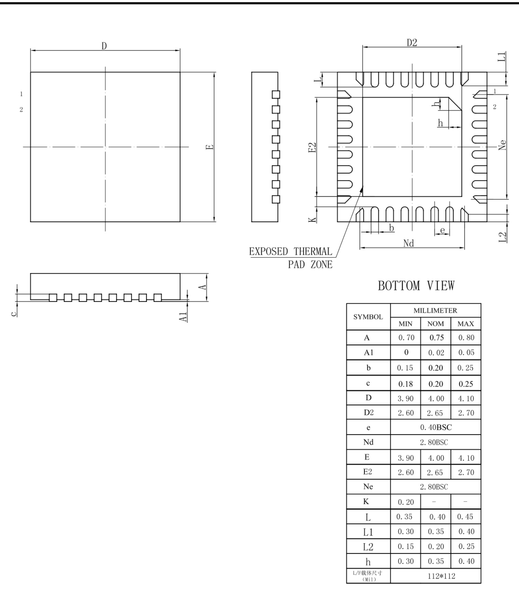  
Copyright $\circledcirc$ 2017, Southchip Semiconductor Technology (Shanghai) Co.,Ltd.